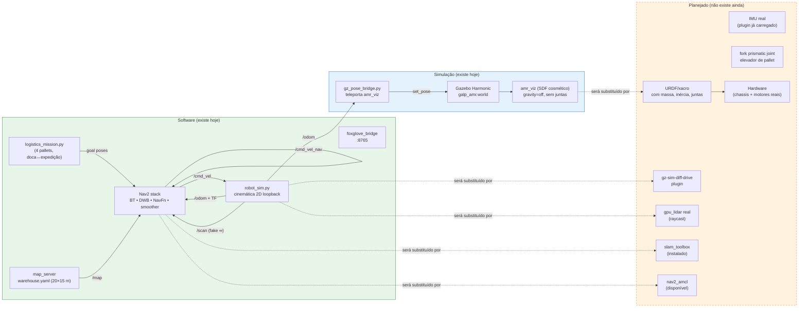
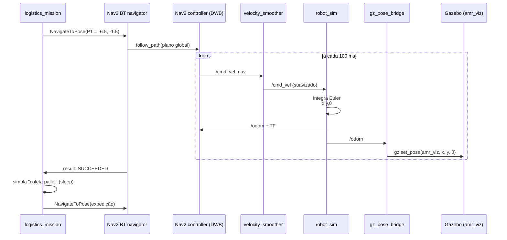

# Arquitetura — robo-amr

> Decisões de stack, componentes do sistema e limitações atuais.
> Última atualização: 2026-05-13.

---

## 1. Componentes do sistema

Visão de alto nível, com o que **existe hoje** em verde e o que está **planejado** em laranja.

### 1.1 Tópicos ROS principais

| Tópico | Tipo | Quem publica | Quem consome |
|---|---|---|---|
| `/cmd_vel_nav` | `geometry_msgs/Twist` | Nav2 controller_server | velocity_smoother |
| `/cmd_vel` | `geometry_msgs/Twist` | velocity_smoother | `robot_sim` |
| `/odom` | `nav_msgs/Odometry` | `robot_sim` (manual) | Nav2 + bridge |
| `/scan` | `sensor_msgs/LaserScan` | `robot_sim` (fake, `inf`) | Nav2 local costmap |
| `/map` | `nav_msgs/OccupancyGrid` | `nav2_map_server` | Nav2 global costmap |
| `/tf`, `/tf_static` | `tf2_msgs/TFMessage` | `robot_sim` | tudo |
| `/navigate_to_pose` (action) | `nav2_msgs/NavigateToPose` | `logistics_mission` | Nav2 BT |

### 1.2 Fluxo de uma missão (sequência)

---

## 2. Decisões de stack

### 2.1 Por que ROS 2 Jazzy (não Humble)

| Critério | Humble (22.04) | **Jazzy (24.04)** ← escolhido |
|---|---|---|
| Status | LTS — fim de suporte **maio/2027** | LTS — fim de suporte **maio/2029** |
| Maturidade Nav2 | Estável | Estável (parity com Humble) |
| Gazebo emparelhado | Fortress (legado) | **Harmonic** (oficial) |
| Python | 3.10 | 3.12 |
| Ubuntu | 22.04 LTS | 24.04 LTS |

**Decisão**: para um projeto greenfield em 2026, escolher Humble é começar com
dois anos de "rio passando por baixo da ponte". Jazzy tem **mais 2 anos de
runway** de suporte, é o que recebe os fixes de Nav2 primeiro, e está pareado
com Gazebo Harmonic — que é o que continuará a evoluir.

**Custos da escolha**:

- Menos tutoriais antigos compatíveis (a maior parte da internet ainda escreve
  para Humble + Fortress). Mitigação: a API ROS 2 é estável; o que muda é mais
  no Gazebo (Ignition → Harmonic) do que no ROS.
- Algum pacote de terceiros raro pode ter binário só para Humble. Mitigação:
  até hoje não bateu — o que precisamos (Nav2, slam_toolbox, foxglove_bridge,
  ros_gz, turtlebot3_*) tem release Jazzy.

### 2.2 Por que Gazebo Harmonic (não Classic, não Fortress, não Isaac Sim)

| Opção | Por que **não** |
|---|---|
| Gazebo Classic (gazebo11) | EOL janeiro/2025. Não recebe mais updates de segurança. Não tem suporte oficial em Ubuntu 24.04. |
| Ignition Fortress | LTS, mas casado com ROS 2 Humble. Em 24.04/Jazzy não roda nativo. |
| Isaac Sim (NVIDIA) | GPU-pesado (precisa RTX), ecossistema fechado, curva de aprendizado alta. Vale a pena depois, para fotorrealismo e RL — não no estágio atual. |
| **Harmonic** ← escolhido | LTS pareado com Jazzy. Suporte até **setembro/2028**. Renderiza com Ogre2; aceita llvmpipe (software) — funciona em RunPod sem GPU. |

**Casamento oficial Ubuntu/ROS/Gazebo** (referência rápida):

| Ubuntu | ROS 2 | Gazebo |
|---|---|---|
| 22.04 | Humble | Fortress |
| 24.04 | **Jazzy** | **Harmonic** |
| 24.04 | Rolling | Ionic / Jetty |

Manter o casamento oficial evita pacotes binários de origem incerta e build
manual a partir de source. **Não tentar misturar**: Jazzy + Fortress, ou
Humble + Harmonic, são caminhos de sofrimento.

### 2.3 Por que `amr_pallet` em vez de `openAMRobot`

O diretório [`openamrobot/`](../openamrobot) é um clone do projeto upstream
[openAMRobot](https://github.com/openAMRobot). Foi avaliado como base e
**descartado** como ponto de partida. Mantemos o clone como referência.

| Critério | openAMRobot | **amr_pallet (interno)** ← escolhido |
|---|---|---|
| Foco do projeto | Plataforma genérica de pesquisa AMR | **Galpão logístico de pallet** (alinhado ao nosso PRD) |
| Status declarado | "Experimental" + aviso de "não use em produção" | nosso, sob controle direto |
| Mundo de simulação | Mundo vazio / mundos de demo | Galpão de 20×15 m com 4 pallets, doca e expedição já modelados |
| Missão pronta | Não | Sim — `logistics_mission.py` faz o ciclo dos 4 pallets |
| URDF do robô | Sim, completo com casters + lidar | Não — temos só SDF cosmético (lacuna conhecida — ver [`ROBOT_ANALYSIS.md`](ROBOT_ANALYSIS.md)) |
| Bridge Gazebo↔ROS | `ros_gz_bridge` padrão | `gz_pose_bridge.py` (teleporte) — débito técnico |
| Governance | Governance externa, processo de contribuição formal | nenhum — velocidade total |
| Customização do produto | Forçaria fork e divergência grande | Liberdade total |

**Decisão**: o `amr_pallet` foi construído **especificamente** para o cenário
de galpão logístico — mundo Gazebo, missão, mapa, waypoints. Adotar o
openAMRobot exigiria recriar quase tudo isso por cima da estrutura deles,
sem ganho proporcional.

**O que vamos reaproveitar do openAMRobot** (não copiar cego — **portar com
crédito**):

- A estrutura do URDF/xacro deles (4 casters + 2 rodas tracionadas + LiDAR)
  como referência para escrever o nosso (Fase 2 do roadmap).
- O padrão de bridge ROS↔Gazebo via `ros_gz_bridge` (substitui nosso
  `gz_pose_bridge.py`).
- A divisão em pacotes (`*_description`, `*_gazebo`, `*_nav2`) como sanidade
  organizacional quando o projeto crescer.

**O que NÃO vamos reaproveitar**:

- Governance / DCO / processo formal.
- Branding deles.
- Modo de operação (genérico AMR vs nosso AMR de pallet).

---

## 3. Limitações conhecidas

Resumo executivo — para análise técnica completa, ver
[`ROBOT_ANALYSIS.md`](ROBOT_ANALYSIS.md).

### 3.1 Robô-fantasma

O "robô" hoje é uma soma de três coisas independentes:

1. **Cinemática 2D em Python** (`robot_sim.py`) — integra `/cmd_vel` na pose,
   sem física.
2. **SDF cosmético** (`models/amr_viz/model.sdf`) — caixinha + cilindros para
   aparecer no Gazebo, com `gravity=false` e sem juntas.
3. **Disco de raio 0.25 m** no Nav2 — é como o planner enxerga o robô.

Não tem URDF, não tem modelo dinâmico, não tem rodas que giram, não tem motor.
Sem isso **nenhuma análise mecânica é possível**, e qualquer comparação com
hardware real é prematura.

### 3.2 LiDAR fake

O `/scan` é fabricado em Python (`robot_sim.py:86-92`) com **todos os 360 raios
em `inf`** — o sensor sempre "vê campo livre". Consequência:

- Nav2 navega sem perceber obstáculos dinâmicos.
- Behaviors como `spin` e `backup` rodam, mas não fazem sentido (não há nada
  para evitar).
- Costmap local é praticamente vazio.

Isso bloqueia qualquer experimento sério com **obstáculos móveis** (outros
robôs, pallets fora do lugar, gente que não devia estar lá).

### 3.3 Localização "trapaceada"

O `robot_sim.py` publica `map → odom` como **identidade fixa**, e a posição
do robô no Gazebo é **teleportada** a 15 Hz por um bridge Python externo
(`gz_pose_bridge.py`). Isso significa:

- **Não há erro de localização** — o robô sempre sabe onde está com precisão
  perfeita.
- AMCL não está em uso (e nem precisa estar nesse modo).
- Não dá para testar comportamentos de re-localização, kidnapping problem, etc.

### 3.4 Sem manipulação

A missão "coleta" e "entrega" pallets executando um `sleep(3)` simbólico. Não
há garfo, não há junta prismática, não há contato físico entre robô e pallet.

### 3.5 Stack só de software

Não há driver de hardware. Não há `ros2_control`. Não há tradução `cmd_vel →
torque/PWM`. Toda a Fase 6 do roadmap está em aberto.

### 3.6 Outras limitações menores

- Único robô (`amr_viz`) — sem multi-robô, sem orquestração de frota.
- `RMW_IMPLEMENTATION=rmw_cyclonedds_cpp` forçado em `loopback` — não está
  pronto para LAN multi-nó.
- Foxglove na porta 8765 sem TLS — ok para LAN/dev, não para produção.
- O `setup_master.sh` cria o usuário `dev` com senha `dev123` — **trocar em
  qualquer ambiente exposto**.

---

## 4. Referências cruzadas

- 📘 [`/workspace/README.md`](../README.md) — visão de produto, roadmap.
- 🚀 [`ONBOARDING.md`](ONBOARDING.md) — como rodar tudo na sua máquina.
- 🔬 [`ROBOT_ANALYSIS.md`](ROBOT_ANALYSIS.md) — análise técnica detalhada,
  localização de cada parâmetro, modificações priorizadas.
