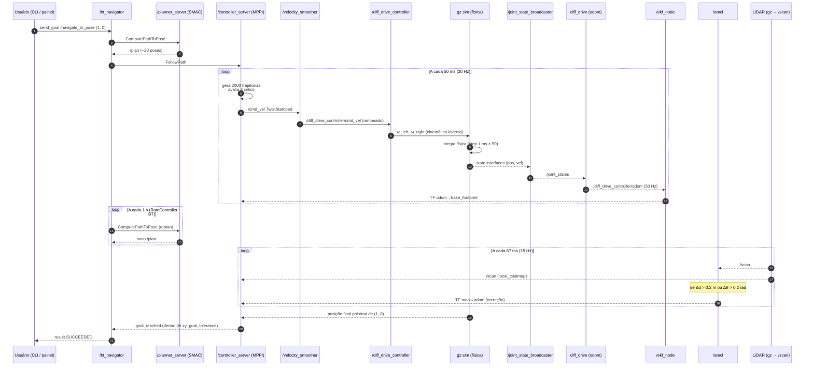

# Como o robô anda 1 metro

> Guia técnico detalhado da pilha **rbot** (ROS 2 Jazzy + Nav2 + Gazebo Harmonic),
> escrito para engenheiros mecânicos com experiência em automação industrial
> (CLP, CNC, drives, encoders). Todos os números aqui são extraídos dos
> arquivos de configuração do projeto — não há valores fictícios.

---

## Sumário

1. [Cenário inicial](#1-cenário-inicial)
2. [Linha do tempo com timestamps](#2-linha-do-tempo-com-timestamps)
3. [Catálogo dos nós envolvidos](#3-catálogo-dos-nós-envolvidos)
4. [Sequência em 6 estágios](#4-sequência-em-6-estágios)
5. [Diagrama Mermaid de sequência](#5-diagrama-mermaid-de-sequência)
6. [Analogia com automação industrial](#6-analogia-com-automação-industrial)
7. [Tabela resumo](#7-tabela-resumo)
8. [Frequências reais do rbot](#8-frequências-reais-do-rbot)

---

## 1. Cenário inicial

### Pose
- Robô parado na pose `(x=0.0, y=0.0, θ=0.0)` no frame `map`.
- Mapa carregado: `small_warehouse.yaml` (400 × 400 células, resolução 0.05 m/célula = 20×20 m).
- Goal recebido pelo usuário: `(x=1.0, y=0.0, θ=0.0)` — caminhar 1 metro reto em X.

### Estado dos nós antes do goal

| Nó | Estado | Última publicação |
|---|---|---|
| `/map_server` | `active [3]` | `/map` (latched, há ~3 s) |
| `/amcl` | `active [3]` | `/amcl_pose` em `(0, 0, 0)` |
| `/ekf_node` | rodando | `/odometry/filtered`, TF `odom→base_footprint` |
| `/robot_state_publisher` | rodando | TF estáticas (chassis, sensores, rodas) |
| `/controller_manager` | rodando | dentro do processo `gz sim`, 100 Hz |
| `/diff_drive_controller` | `active` | `/diff_drive_controller/odom` |
| `/joint_state_broadcaster` | `active` | `/joint_states` (~24 Hz) |
| `/planner_server` | `active [3]` | nada (sem goal) |
| `/controller_server` | `active [3]` | nada (sem goal) |
| `/bt_navigator` | `active [3]` | aguarda action `/navigate_to_pose` |
| `/velocity_smoother` | rodando | nada (entrada zerada) |
| Gazebo (`gz sim -r -s`) | step 1ms, RTF=0.15 (modo didático) | `/clock`, `/scan`, `/imu/data_raw`, etc. |

### Frames TF ativos
```
map ──(AMCL: estimativa de localização)──> odom
       └──(EKF: fusão odom roda + IMU)──> base_footprint
                                          └──(static, robot_state_publisher)──> base_link
                                                                                ├── left_wheel_link
                                                                                ├── right_wheel_link
                                                                                ├── lidar_2d_link
                                                                                ├── imu_link
                                                                                └── depth_camera_link
```

---

## 2. Linha do tempo com timestamps

Tempos em milissegundos a partir do instante em que o `bt_navigator` recebe o goal.
Eventos cíclicos (sensores, controllers) marcados com `~` indicam fase aproximada.

| t (ms) | Evento | Quem | Saída |
|---:|---|---|---|
| 0 | Usuário chama action `/navigate_to_pose` com goal `(1.0, 0.0)` | cliente (painel ou CLI) | `goal_id = uuid` |
| 5 | `bt_navigator` valida goal e tica o BT pela primeira vez | `bt_navigator` | log "Begin navigating from (0.00, 0.00) to (1.00, 0.00)" |
| 8 | BT entra em `NavigateRecovery → PipelineSequence → RateController(1 Hz) → ComputePathToPose` | BT | invocação action `/compute_path_to_pose` |
| 12 | `planner_server` recebe pedido, lê pose atual via TF `map→base_footprint` | planner | inicia busca SMAC Hybrid-A* |
| 12 → 80 | SMAC expande nós: open list, closed list, heurística Dubin | planner | nenhum tópico ainda |
| 85 | `planner_server` retorna caminho com ~20 poses, espaçadas ~0.05 m | planner | publica `/plan` (uma vez) |
| 90 | BT segue para `FollowPath`, chama action `/follow_path` | BT | invoca controller |
| 95 | `controller_server` recebe `/plan`, transforma para frame `odom`, prepara MPPI | controller | publica `/transformed_global_plan` |
| 100 | **Ciclo MPPI #1** (período 50 ms = 20 Hz) | controller | gera 2000 trajetórias, escolhe melhor |
| 102 | controller publica `/cmd_vel` (TwistStamped) `{linear.x ≈ 0.20, angular.z ≈ 0.0}` | controller | `/cmd_vel`, `/optimal_trajectory`, `/trajectories` |
| 105 | `velocity_smoother` (período 50 ms = 20 Hz) aplica rampa de aceleração ≤ 1.0 m/s² | smoother | `/diff_drive_controller/cmd_vel` `{linear.x = 0.05}` (após 1 ciclo de rampa) |
| 110 | `diff_drive_controller` (100 Hz) converte twist → ω_left, ω_right | diff_drive | escreve velocity command interface das junções |
| ~110 | `gz_ros2_control` plugin lê command, aplica torque em `left_wheel_joint` e `right_wheel_joint` | gz_ros_control | física do Gazebo |
| ~115 | Gazebo simula → wheels giram → robô translaciona alguns mm | gz sim | `/clock` avança |
| 150 | **Ciclo MPPI #2** | controller | `/cmd_vel` com vx ainda crescendo (rampa) |
| ~200 | Encoders das rodas: posições atualizadas (`/joint_states`) | joint_state_broadcaster | sensor_msgs/JointState |
| ~200 | `diff_drive_controller` calcula odometria por integração cinemática | diff_drive | `/diff_drive_controller/odom` (50 Hz) |
| ~200 | EKF integra odometria + IMU (`/imu/data` filtrado a 200 Hz) | ekf_node | TF `odom → base_footprint`, `/odometry/filtered` |
| ~267 | Primeiro scan do LiDAR após início (período 67 ms = 15 Hz) | gz sim → bridge | `/scan` (720 raios, ±π, range 0.3–25 m) |
| ~270 | AMCL (apenas atualiza se `update_min_d=0.2 m` ou `update_min_a=0.2 rad`) | amcl | `/amcl_pose`, `/particle_cloud`, TF `map → odom` |
| 500 | `local_costmap` (5 Hz) reprojeta últimas medidas em grade local 3×3 m | local_costmap | `/local_costmap/costmap` |
| 1000 | `global_costmap` (1 Hz) atualiza camadas estática + inflação | global_costmap | `/global_costmap/costmap` |
| 1000 | `RateController(1 Hz)` do BT dispara novo `ComputePathToPose` (replan) | BT | novo `/plan` |
| ~3 000 | Robô passou de x=0 → x≈0.05 m (15 mm/s real, atrito ainda baixo nesta sim) | física | `/diff_drive_controller/odom` `{x≈0.6 cinemático}` |
| ~70 000 | Robô fisicamente alcança `x ≈ 0.96 m` — dentro de `xy_goal_tolerance` (0.25 m) | controller | BT recebe `goal_reached` |
| ~70 100 | BT termina, devolve `result.SUCCEEDED` ao cliente | bt_navigator | log "Goal succeeded" |

> Em hardware real (sem o slip de simulação) o robô percorreria 1 m em ~5 segundos
> (0.20 m/s comandados). Os ~70 s observados refletem o slip da simulação Gazebo
> Harmonic com `gz_ros2_control` — não há nada errado com a stack de software.

---

## 3. Catálogo dos nós envolvidos

### 3.1 `/bt_navigator`

- **Função:** Cérebro orquestrador. Lê uma árvore de comportamento (XML) e decide,
  a cada *tick*, qual ação executar (planejar, seguir caminho, recuperar). É o
  "PLC mestre" da navegação.
- **Inputs:** action `/navigate_to_pose`, sub-actions `/compute_path_to_pose`,
  `/follow_path`, services para limpar costmap, etc.
- **Outputs:** `/behavior_tree_log` (debug), `/bt_navigator/transition_event`,
  resultado da action.
- **Frequência:** tick a 10 Hz por padrão; `RateController` interno limita o
  replanejamento a **1 Hz**.
- **Onde mora:** pacote `nav2_bt_navigator` (`/opt/ros/jazzy/lib/nav2_bt_navigator/bt_navigator`).
  BT XML do projeto: `/workspace/rbot/install/rlai_navigation/share/rlai_navigation/behavior_trees/navigate_to_pose.xml`.

### 3.2 `/planner_server` (SMAC Hybrid-A*)

- **Função:** Calcula o caminho **global**, do ponto atual até o goal,
  respeitando geometria do robô e obstáculos do `/global_costmap`. Equivalente
  ao CAM gerando trajetória offline para uma CNC.
- **Inputs:** action `/compute_path_to_pose` (pose start + goal),
  `/global_costmap/costmap` (assinatura).
- **Outputs:** `/plan` (lista `nav_msgs/Path` com ~20–40 poses).
- **Frequência:** sob demanda — invocado pelo BT a cada 1 s.
- **Onde mora:** `nav2_planner` (binário). Plugin: `nav2_smac_planner::SmacPlannerHybrid`.
  Configuração: `nav2_params.yaml` seção `planner_server.GridBased`. Parâmetros chave:
  `minimum_turning_radius: 0.25 m`, `angle_quantization_bins: 72` (5° por bin),
  `max_iterations: 1 000 000`, `max_planning_time: 5.0 s`, motion model: **Dubin**.

### 3.3 `/controller_server` (MPPI)

- **Função:** Controle **local** — recebe o caminho global e gera comandos de
  velocidade em malha fechada considerando obstáculos próximos. Análogo a um
  controlador PID multivariável com modelo preditivo.
- **Inputs:** `/plan`, `/local_costmap/costmap`, TF `odom→base_footprint`.
- **Outputs:** `/cmd_vel` (TwistStamped), `/optimal_trajectory`, `/trajectories`
  (visualização das 2000 amostras).
- **Frequência:** **20 Hz** (`controller_frequency: 20.0`).
- **Onde mora:** `nav2_controller` + plugin `nav2_mppi_controller::MPPIController`.
  Configuração: `nav2_params.yaml` seção `controller_server.FollowPath`.
  Parâmetros chave: `batch_size: 2000`, `time_steps: 56`, `model_dt: 0.05`
  (horizonte 2.8 s), `temperature: 0.3`, `gamma: 0.015`, 8 critics.

### 3.4 `/global_costmap`

- **Função:** Grade ocupacional **estática** (parede, prateleiras) + inflação
  ao redor dos obstáculos para que o planner mantenha distância segura.
- **Inputs:** `/map` (do `/map_server`), `/scan` (camada `obstacle_layer`).
- **Outputs:** `/global_costmap/costmap`, `/global_costmap/footprint`.
- **Frequência:** `update_frequency: 1.0 Hz`, `publish_frequency: 1.0 Hz`,
  `resolution: 0.05 m`. Cobre toda a área do mapa.

### 3.5 `/local_costmap`

- **Função:** Grade rolante de **3 m × 3 m** centrada no robô, atualizada com
  cada scan do LiDAR. É o que o MPPI consulta para evitar obstáculos *agora*.
- **Inputs:** `/scan`, TF `odom→base_footprint`.
- **Outputs:** `/local_costmap/costmap`, `/local_costmap/published_footprint`.
- **Frequência:** `update_frequency: 5.0 Hz`, `publish_frequency: 2.0 Hz`,
  `resolution: 0.05 m`.

### 3.6 `/map_server` e `/amcl`

- **`/map_server`:** carrega `small_warehouse.yaml` uma vez na inicialização e
  publica `/map` *latched* (qualquer subscriber novo recebe a última msg).
  Análogo a um arquivo G-code carregado no CNC.
- **`/amcl`:** Adaptive Monte Carlo Localization. Mantém 500–2000 partículas
  candidatas para a pose do robô em `map`, e ajusta-as comparando o `/scan`
  com o mapa. Publica TF `map → odom`. Análogo a um sistema de referência
  absoluta (e.g., trilho com leitores RFID validando contra o encoder).
- **Frequência AMCL:** dispara apenas quando o robô se moveu mais que
  `update_min_d: 0.2 m` ou girou mais que `update_min_a: 0.2 rad`.
  Cada update usa `max_beams: 60` (downsample dos 720 raios), modelo
  `likelihood_field`.

### 3.7 `/ekf_node` (robot_localization)

- **Função:** Filtro de Kalman Estendido. Funde **odometria de rodas** (lenta,
  ~50 Hz, sujeita a drift) com **IMU** (rápida, 200 Hz, sem drift de orientação
  curto prazo). Saída: TF `odom → base_footprint` e `/odometry/filtered`.
- **Inputs:**
  - `/diff_drive_controller/odom` (configurado para fundir `x, y, yaw, vx, wz`)
  - `/imu/data` (gyro + accel; **orientação do IMU não é fundida** — EKF
    integra `yaw` do gyro)
- **Output:** TF `odom→base_footprint` (publicador exclusivo dessa transformação;
  o `diff_drive_controller` tem `enable_odom_tf: false`), `/odometry/filtered`.

### 3.8 `/velocity_smoother`

- **Função:** "Rampa" entre o `/cmd_vel` do controller e o
  `/diff_drive_controller/cmd_vel` real. Limita aceleração e deceleração para
  não sacudir o robô. Análogo à rampa de aceleração programada num inversor de
  frequência.
- **Inputs:** `/cmd_vel` (TwistStamped).
- **Outputs:** `/diff_drive_controller/cmd_vel` (TwistStamped).
- **Frequência:** `smoothing_frequency: 20.0 Hz`.
- **Limites do projeto:**
  - linear x: `+0.5 / -0.35 m/s`, aceleração `±1.0 m/s²`
  - angular z: `±1.9 rad/s`, aceleração `±3.2 rad/s²`
- **Timeout:** se nenhum comando chega em 1 s, publica zero (deadman).
- **Configuração:** `/workspace/rbot/install/rlai_control/share/rlai_control/config/velocity_smoother.yaml`.

### 3.9 `/diff_drive_controller`

- **Função:** Cinemática inversa de robô diferencial. Recebe `(vx, ωz)` e
  produz `(ω_left, ω_right)` para as duas rodas motrizes. Também integra
  `/joint_states` para publicar odometria de roda. Análogo ao drive servo-motor
  de uma esteira: recebe um setpoint linear, distribui em ângulos de rotação.
- **Cinemática:**
  ```
  ω_left  = (vx − (wheel_separation / 2) · ωz) / wheel_radius
  ω_right = (vx + (wheel_separation / 2) · ωz) / wheel_radius
  ```
  Com `wheel_separation = 0.35 m`, `wheel_radius = 0.0625 m`.
- **Inputs:** `/diff_drive_controller/cmd_vel`, command interfaces `velocity`
  das junções `left_wheel_joint` e `right_wheel_joint`.
- **Outputs:** `/diff_drive_controller/odom` (50 Hz).
- **Frequência:** roda dentro do loop do `controller_manager` a **100 Hz**.
- **Configuração:** `/workspace/rbot/install/rlai_control/share/rlai_control/config/controllers.yaml`.

### 3.10 `/joint_state_broadcaster`

- **Função:** Lê os state interfaces (`position` e `velocity`) de todas as
  junções relevantes e publica em `/joint_states`. Análogo ao módulo de
  entrada digital + analógica do CLP que coleta encoders e limit switches.
- **Junções monitoradas:** 2 motoras (`left_wheel`, `right_wheel`) + 4 casters
  (×2 cada: swivel + wheel) = 10 junções, 20 state interfaces (pos+vel cada).
- **Output:** `/joint_states` (~24 Hz no projeto — a 100 Hz controller_manager,
  mas o broadcaster publica conforme dt do solver da física, que em modo
  slow-motion é menor).

### 3.11 `/robot_state_publisher`

- **Função:** Lê o URDF (em `/robot_description`) e a cada `/joint_states`
  atualiza a TF tree do robô — quem é pai de quem, com que offset. Como uma
  planta de montagem do CLP que sabe a relação entre cada eixo.
- **Output:** `/tf` (não-estáticas: junções), `/tf_static` (offsets fixos como
  posição de sensores).

### 3.12 `/imu_filter_madgwick`

- **Função:** Filtro de Madgwick — converte `/imu/data_raw` (gyro+accel sem
  orientação) em `/imu/data` (com quaternion estimado). Análogo a um módulo
  de fusão sensor inercial em uma máquina ferramenta.
- **Frequência:** acompanha o IMU (200 Hz).
- **Topic out:** `/imu/data`.

### 3.13 `gz sim -r -s` (server) + plugin `gz_ros2_control`

- **Função:** Motor de física. Integra equações de movimento, processa contatos,
  simula sensores (LiDAR, IMU, câmeras). O plugin `gz_ros2_control` instancia
  o `controller_manager` ROS 2 *dentro do processo gz*, fazendo a ponte entre
  command/state interfaces e a física.
- **Frequência da física:** step size 1 ms (1000 Hz teórico), mas em modo
  didático `real_time_factor: 0.15` → caminha a 15 % do tempo real.

### 3.14 `/ros_gz_bridge` (parameter_bridge)

- **Função:** Pontes bidirecionais entre tópicos Gazebo (`gz.msgs`) e ROS 2
  (`std_msgs`/`sensor_msgs`). Faz o tradutor de protocolos do CLP para uma
  rede industrial diferente.
- **Bridges relevantes:**
  - `/clock` (gz → ros)
  - `/scan` (gz → ros)
  - `/imu/data_raw` (gz → ros)
  - `/depth_camera/depth`, `/depth_camera/image_raw`, `/depth_camera/camera_info`
  - `/lidar_3d/points_raw`
  - `/gps/fix`
  - `/stereo/{left,right}/{image_raw,camera_info}`

---

## 4. Sequência em 6 estágios

### Estágio 1 — Receber ordem

1. Cliente (painel didático ou `ros2 action send_goal`) chama action
   `/navigate_to_pose` com `Goal.pose = {map; (1, 0, 0)}`.
2. `bt_navigator` aceita o goal, retorna `goal_handle` ao cliente, e começa a
   ticar o BT XML `navigate_to_pose.xml`.
3. A árvore raiz é um `RecoveryNode` com 6 retries; o ramo principal é uma
   `PipelineSequence`:
   - `ControllerSelector` / `PlannerSelector` — escolhe plugin (`FollowPath` /
     `GridBased`, defaults).
   - `RateController(1 Hz)` envolvendo `ComputePathToPose` — replan a 1 Hz.
   - `RecoveryNode` envolvendo `FollowPath` — segue o caminho, com fallback de
     limpar local costmap se falhar.
4. Em caso de falha repetida: o BT entra no `RecoveryFallback` com `Spin 1.57`,
   `Wait 5s`, `BackUp 0.30 m` (rota de recuperação).

### Estágio 2 — Percepção (LiDAR + IMU + odometria)

#### 2.1 LiDAR
- Gazebo simula um GPU-LiDAR 2D no link `lidar_2d_link`. A cada **67 ms (15 Hz)**:
  - 720 raios são lançados de −π a +π (`resolution: 1` em cada direção).
  - Para cada raio: range entre 0.30 m e 25.0 m, ruído gaussiano σ=0.01 m.
  - O sensor publica `gz.msgs.LaserScan` em `/scan` (topic GZ).
- `ros_gz_bridge` converte para `sensor_msgs/LaserScan` no `/scan` ROS.
- Cada ponto LiDAR vira coordenada:
  ```
  índice_raio i ∈ [0, 719]
  ângulo θ_i  = angle_min + i · angle_increment
              = −π + i · (2π / 720) = −π + i · 0.00873 rad (≈ 0.5°)
  range r_i   = mensagem.ranges[i]   (em metros, ou inf/nan se sem retorno)
  ponto local: (r_i · cos θ_i, r_i · sin θ_i)
  ```
- O `local_costmap` (camada `obstacle_layer`) e o `/amcl` se inscrevem em `/scan`.

#### 2.2 Como o scan entra no costmap
- A camada `obstacle_layer` projeta cada ponto do `/scan` em uma célula da
  grade (`resolution: 0.05 m`). A célula recebe `lethal_cost (254)`.
- A camada `inflation_layer` propaga um decay exponencial ao redor das células
  letais, definindo zonas de "muito perto" (`inscribed_radius`) e "longe o
  bastante" (`inflation_radius`).
- Custo final por célula: `cost = max(static, obstacle, inflation)`.

#### 2.3 Odometria de roda (`/diff_drive_controller/odom`)
- A cada ciclo de 100 Hz, o `diff_drive_controller` lê posição angular das
  rodas (state interface `position`).
- Cinemática direta:
  ```
  Δs_left  = (pos_left_now  − pos_left_prev)  · wheel_radius
  Δs_right = (pos_right_now − pos_right_prev) · wheel_radius
  Δs    = (Δs_left + Δs_right) / 2
  Δθ    = (Δs_right − Δs_left) / wheel_separation
  novo_x   = x + Δs · cos(θ + Δθ/2)
  novo_y   = y + Δs · sin(θ + Δθ/2)
  novo_θ   = θ + Δθ
  ```
- Publica `/diff_drive_controller/odom` a **50 Hz**.

#### 2.4 EKF — fundir odometria e IMU
- `ekf_node` consome:
  - `/diff_drive_controller/odom` — usado para estimar `x, y, yaw, vx, wz`.
  - `/imu/data` (após filtro Madgwick em 200 Hz) — usado para `yaw_rate`,
    `ax`, `ay`. **Orientação do IMU NÃO é fundida** (decisão de projeto:
    integra o gyro para evitar descontinuidades de quaternion em piso plano).
- A cada nova mensagem, o EKF faz o passo predição + correção e publica:
  - TF `odom → base_footprint` (publicador exclusivo).
  - `/odometry/filtered`.

#### 2.5 AMCL — corrigir contra o mapa
- A cada scan, AMCL verifica se o robô andou ≥ 0.2 m ou girou ≥ 0.2 rad
  (`update_min_d`, `update_min_a`); só processa se sim.
- Modelo de movimento: `DifferentialMotionModel` com ruídos `α1..α4 = 0.2`.
- Modelo do sensor: `likelihood_field` com `max_beams: 60` (downsample dos
  720 raios), `sigma_hit: 0.2 m`, `z_hit: 0.5`, `z_rand: 0.5`.
- 500 a 2000 partículas (KLD-adaptive); resample a cada update.
- Publica TF `map → odom` (não `map → base_footprint` — preserva separação de
  responsabilidades com o EKF).

### Estágio 3 — Planejamento global (SMAC Hybrid-A*)

- O BT (a cada 1 s via `RateController`) chama a action `/compute_path_to_pose`.
- `planner_server` lê pose atual via TF `map → base_footprint` e passa para o
  plugin `SmacPlannerHybrid`.
- **SMAC Hybrid-A***:
  - Discretiza o espaço de estados em `(x_cell, y_cell, θ_bin)`, com
    `angle_quantization_bins: 72` (5° por bin).
  - Espaço de busca: `OpenList` (heap mínimo) e `ClosedList` (hash set).
  - **Open list** = nós descobertos mas não expandidos, ordenados por
    `f = g + h` (custo até agora + heurística para o goal). Análogo à fila de
    coordenadas candidatas que o CAM avalia.
  - **Closed list** = nós já expandidos (não revisitamos).
  - Em cada iteração: pega o nó de menor `f` da open list, gera vizinhos
    aplicando primitivas Dubin (`minimum_turning_radius: 0.25 m`), avalia custo
    de cada vizinho consultando o `/global_costmap`.
  - **Analytic expansion**: a cada `analytic_expansion_ratio: 3.5` expansões,
    tenta uma reta direta para o goal — se a curva Dubin não colide com
    obstáculos, aceita e sai cedo.
  - Para no `goal_reached` (tolerância `0.5 m`) ou em `max_iterations:
    1 000 000` ou em `max_planning_time: 5.0 s`.
- **Saída**: caminho com ~20 poses (para 1 m de distância), publicado em `/plan`.
  Tipicamente convergência em < 100 ms para campo livre.

### Estágio 4 — Controle local (MPPI)

A cada 50 ms (20 Hz), `controller_server` executa o ciclo MPPI:

1. **Leitura de estado**: pose atual (TF `odom → base_footprint`),
   velocidade atual (do `/odometry/filtered`), porção do caminho global
   próxima (`prune_distance: 1.7 m`).
2. **Geração de 2000 trajetórias candidatas**:
   - Para cada trajetória, aplica ruído gaussiano sobre o último comando ótimo:
     `vx ~ N(vx_prev, vx_std=0.2)`, `ωz ~ N(ωz_prev, wz_std=0.4)`.
   - Cada trajetória tem `time_steps: 56` passos de `model_dt: 0.05 s` =
     2.8 segundos de horizonte.
   - Aplica modelo cinemático `DiffDrive` para propagar cada trajetória no tempo.
3. **Avaliação por 8 critics** (cada um dá um custo escalar; soma ponderada):

   | Critic | Peso | O que penaliza |
   |---|---:|---|
   | `ConstraintCritic` | 4.0 | comandos fora dos limites de velocidade |
   | `CostCritic` (com `InflationCostCritic`) | 300.0 / 0.015 | atravessar células de alto custo no local_costmap (colisão) |
   | `GoalCritic` | 5.0 | distância até o goal final |
   | `GoalAngleCritic` | 3.0 | desvio angular em relação ao goal yaw |
   | `PathAlignCritic` / `ReferenceTrajectoryCritic` | 14.0 | distância lateral ao path global |
   | `PathFollowCritic` | (default) | atraso ao longo do path |
   | `PathAngleCritic` | 2.0 | desalinhamento do yaw com a direção do path |
   | `PreferForwardCritic` | 5.0 | comandos de velocidade negativa (ré) |

4. **Cálculo do peso de cada trajetória**:
   ```
   w_i = exp( −(custo_i − custo_min) / temperature )       # temperature = 0.3
   ```
5. **Comando final** = média ponderada dos comandos amostrados, suavizada pelo
   `gamma: 0.015`. Publica:
   - `/cmd_vel` (TwistStamped) — comando para o smoother.
   - `/optimal_trajectory` — Path da trajetória escolhida (visualização).
   - `/trajectories` — MarkerArray com todas as 2000 amostras (debug).

Para `(0, 0) → (1, 0)` em campo aberto, a saída típica é
`{linear.x ≈ 0.2 m/s, angular.z ≈ 0 rad/s}` constante até desacelerar perto do goal.

### Estágio 5 — Execução do comando

1. `/cmd_vel` → `velocity_smoother` (20 Hz):
   - Se o novo comando exigir `Δvx > max_accel × dt` = `1.0 × 0.05 = 0.05 m/s`,
     o smoother limita a esse incremento. Resultado: rampa monotônica.
   - Aplica também `max_velocity: 0.5 m/s` e `max_decel: -1.0 m/s²`.
   - Publica `/diff_drive_controller/cmd_vel`.
2. `diff_drive_controller` (100 Hz, no controller_manager dentro do gz sim):
   - Lê o último TwistStamped, calcula `ω_left, ω_right` (cinemática inversa).
   - Escreve as duas velocity command interfaces das junções.
3. `gz_ros2_control` propaga o command para o motor virtual da junção
   (servo de velocidade idealizado pelo Gazebo).
4. Gazebo (step 1 ms) calcula:
   - Torque resultante no joint para atingir a velocidade comandada.
   - Reação no corpo do chassis (Newton-Euler).
   - Forças de atrito de contato roda↔chão (mu=2.0 conforme `surface/friction/ode`
     no `gazebo_materials.urdf.xacro`).
   - Movimento resultante do `base_link`.

### Estágio 6 — Feedback

1. Após a integração da física, o Gazebo expõe os novos `position` e `velocity`
   das junções via state interfaces.
2. `joint_state_broadcaster` lê e publica `/joint_states`
   (sensor_msgs/JointState).
3. `robot_state_publisher` consome `/joint_states` e atualiza a TF de cada
   junção (roda esquerda/direita girou, casters mudaram, etc.).
4. `diff_drive_controller` reusa o `position` dos wheels para calcular
   novo `/diff_drive_controller/odom`.
5. `ekf_node` consome o novo odom + última `/imu/data` e republica
   `odom → base_footprint`.
6. `amcl` (se andou > 0.2 m) processa o próximo `/scan` e republica
   `map → odom`.
7. **Loop fechado**: o `controller_server` (Estágio 4) vê estado atualizado no
   próximo ciclo de 50 ms e gera novo `/cmd_vel`.

---

## 5. Diagrama Mermaid de sequência



---

## 6. Analogia com automação industrial

Para um engenheiro vindo do mundo de CLP, CNC, drives e encoders, vale traduzir
cada componente da pilha para o equivalente industrial mais próximo.

| Componente rbot | Equivalente industrial | Comentário |
|---|---|---|
| `/bt_navigator` (Behavior Tree) | **PLC mestre** com lógica ladder/SFC | Decide o estado (planejar, executar, recuperar). O BT XML é a "ladder logic" do projeto. |
| `/navigate_to_pose` (action) | **Receita do CLP** (start cycle) | O cliente dispara, o CLP confirma aceitação e devolve status quando termina. |
| `/map_server` + `/map` | **G-code carregado no CNC** | Mapa estático, lido uma vez, latched. |
| `/global_costmap` | **Tela do supervisório** mostrando obstáculos | Atualizada a 1 Hz, é a visão estratégica do ambiente. |
| `/local_costmap` | **Janela de aproximação** da CNC (sensor de colisão) | 3×3 m, atualizada a 5 Hz, baseada no LiDAR atual. |
| LiDAR 2D (`/scan`) | **Array de sensores de proximidade** (720 sensores) | 720 raios distribuídos em 360°, leitura síncrona a 15 Hz. |
| IMU (`/imu/data_raw`) | **Sensor inercial** (acelerômetro + giroscópio MEMS) | Análogo a um IMU industrial Bosch BMI085. |
| `/imu_filter_madgwick` | **Filtro digital embarcado** no módulo IMU | Converte raw em quaternion estimado. |
| `/joint_state_broadcaster` | **Módulo de entradas** do CLP lendo encoders | Faz a varredura periódica dos sinais de posição. |
| `/diff_drive_controller` | **Drive servo-motor dual** (cinemática inversa interna) | Recebe setpoint linear/angular, distribui para os 2 motores. |
| `/velocity_smoother` | **Rampa de aceleração** programada no inversor de frequência | Limita jerk e respeita acel/decel mecânicos. |
| `/ekf_node` | **Função de fusão sensorial** (Kalman) do controle de movimento | Une encoder + giroscópio para pose suave. |
| `/amcl` | **Sistema de referência absoluto** (RFID, fiducial markers) | Corrige drift comparando "o que vejo" com "o mapa". |
| SMAC Hybrid-A* (planner_server) | **CAM gerando trajetória offline** | Calcula path completo respeitando geometria. |
| MPPI (controller_server) | **Controlador preditivo modelo (MPC)** | PID seria reativo demais; MPPI prevê 2.8 s à frente. |
| 8 critics do MPPI | **Função de custo do otimizador** do MPC | Soma ponderada de penalidades (colisão, desalinhamento, etc.). |
| Gazebo + `gz_ros2_control` | **HIL/SIL** (Hardware/Software-in-the-Loop) | Substitui hardware real; integra física + plugins. |
| `/ros_gz_bridge` | **Gateway entre redes industriais** (Profibus ↔ Ethernet/IP) | Traduz mensagens entre dois protocolos. |
| `/clock` (com `use_sim_time:=true`) | **Clock do CLP** vs. clock do PC supervisório | Em simulação, todos os nós usam o tempo do Gazebo. |
| `/cmd_vel` | **Word de comando** do drive (setpoint de velocidade) | Bus de comando entre lógica e atuador. |
| TF tree | **Tabela de offsets cinemáticos** da máquina (cadeia de bases) | Quem está fixo em relação a quem, com que matriz homogênea. |
| Lifecycle node (active/inactive) | **Modo "RUN" vs "STOP"** do CLP | Configurado uma vez, ativado quando seguro. |

---

## 7. Tabela resumo

> Esta tabela mostra **um único ciclo** ideal do passo 0 → 1 m
> (não inclui replanejamentos nem updates do AMCL, que ocorrem em paralelo).

| Tempo (ms) | Nó                         | Ação                                                                | Tópico/Service publicado            |
|-----------:|----------------------------|---------------------------------------------------------------------|-------------------------------------|
|       0    | cliente                    | Envia goal `/navigate_to_pose (1, 0)`                               | (action goal)                       |
|       5    | `/bt_navigator`            | Aceita goal, tica BT raiz                                           | `/behavior_tree_log`                |
|       8    | `/bt_navigator`            | Chama `/compute_path_to_pose`                                       | (action request)                    |
|      12    | `/planner_server`          | Lê pose via TF `map→base_footprint`                                 | —                                   |
|   12→85    | `/planner_server`          | Busca SMAC Hybrid-A* (open/closed list, Dubin)                      | —                                   |
|      85    | `/planner_server`          | Retorna caminho (~20 poses) ao BT                                   | `/plan`                             |
|      90    | `/bt_navigator`            | Chama `/follow_path`                                                | (action request)                    |
|      95    | `/controller_server`       | Transforma path para frame `odom`                                   | `/transformed_global_plan`          |
|     100    | `/controller_server`       | Ciclo MPPI #1: 2000 amostras × 56 passos × 8 critics                | —                                   |
|     102    | `/controller_server`       | Publica `/cmd_vel` (vx≈0.05, ωz≈0) e visualização                   | `/cmd_vel`, `/optimal_trajectory`, `/trajectories` |
|     105    | `/velocity_smoother`       | Aplica rampa (`max_accel: 1.0 m/s²`)                                | `/diff_drive_controller/cmd_vel`    |
|     110    | `/diff_drive_controller`   | Cinemática inversa → `ω_left, ω_right`                              | (command interfaces das junções)    |
|     115    | `gz sim` + `gz_ros2_control` | Aplica torque, integra física (step 1 ms)                         | `/clock` avança                     |
|     150    | `/controller_server`       | Ciclo MPPI #2 (próximo período de 50 ms)                            | `/cmd_vel` atualizado               |
|     200    | `/joint_state_broadcaster` | Lê encoders virtuais, publica posições angulares                    | `/joint_states`                     |
|     200    | `/diff_drive_controller`   | Integração cinemática direta → odometria de roda                    | `/diff_drive_controller/odom` (50 Hz) |
|     200    | `/ekf_node`                | Funde odom + IMU; publica TF `odom→base_footprint`                  | TF, `/odometry/filtered`            |
|     267    | gz LiDAR                   | Primeiro scan completo após o goal (período 67 ms = 15 Hz)          | `/scan`                             |
|     270    | `/amcl`                    | Se Δd > 0.2 m, recalcula partículas e publica TF `map→odom`         | `/amcl_pose`, `/particle_cloud`, TF |
|     500    | `/local_costmap`           | Update da grade 3×3 m com novos scans                               | `/local_costmap/costmap`            |
|    1 000   | `/global_costmap`          | Update da grade global                                              | `/global_costmap/costmap`           |
|    1 000   | `/bt_navigator`            | `RateController(1 Hz)` dispara novo `ComputePathToPose`             | novo `/plan`                        |
|  ~70 000   | `/controller_server`       | Robô chegou em `xy_goal_tolerance` — termina FollowPath              | (action result)                     |
|  ~70 100   | `/bt_navigator`            | BT retorna `SUCCEEDED` ao cliente                                   | log "Goal succeeded"                |

---

## 8. Frequências reais do rbot

> Valores extraídos de:
> - `/workspace/rbot/install/rlai_description/share/rlai_description/urdf/gazebo/gazebo_sensors.urdf.xacro`
> - `/workspace/rbot/install/rlai_navigation/share/rlai_navigation/config/nav2_params.yaml`
> - `/workspace/rbot/install/rlai_control/share/rlai_control/config/controllers.yaml`
> - `/workspace/rbot/install/rlai_control/share/rlai_control/config/velocity_smoother.yaml`
> - `/workspace/rbot/install/rlai_localization/share/rlai_localization/config/{ekf,amcl}.yaml`

| Componente                  | Frequência                                | Configurada em                          |
|-----------------------------|-------------------------------------------|-----------------------------------------|
| LiDAR 2D (`/scan`)          | **15 Hz**, 720 raios                      | `gazebo_sensors.urdf.xacro`             |
| LiDAR 3D (`/lidar_3d/...`)  | **10 Hz**, 1800 × 16 raios                | `gazebo_sensors.urdf.xacro`             |
| IMU (`/imu/data_raw`)       | **200 Hz**                                | `gazebo_sensors.urdf.xacro`             |
| Filtro Madgwick             | **200 Hz** (segue IMU)                    | `simulation.launch.py`                  |
| Câmera RGB / depth          | **30 Hz**                                 | `gazebo_sensors.urdf.xacro`             |
| Stereo cameras              | **30 Hz** cada                            | `gazebo_sensors.urdf.xacro`             |
| GPS (`/gps/fix`)            | **10 Hz**                                 | `gazebo_sensors.urdf.xacro`             |
| `controller_manager` loop   | **100 Hz** (`update_rate`)                | `controllers.yaml`                      |
| `diff_drive_controller`     | **100 Hz** (segue controller_manager)     | `controllers.yaml`                      |
| `diff_drive` odom publish   | **50 Hz** (`odom_publish_rate`)           | `controllers.yaml`                      |
| `joint_state_broadcaster`   | **100 Hz** teórico (varia com slowmo)     | `controllers.yaml`                      |
| `controller_server` (MPPI)  | **20 Hz** (`controller_frequency`)        | `nav2_params.yaml`                      |
| MPPI trajetórias por ciclo  | **2000** (`batch_size`)                   | `nav2_params.yaml`                      |
| MPPI passos por trajetória  | **56** (`time_steps`) × 0.05 s = 2.8 s    | `nav2_params.yaml`                      |
| `velocity_smoother`         | **20 Hz** (`smoothing_frequency`)         | `velocity_smoother.yaml`                |
| `bt_navigator` tick         | **10 Hz** (default Nav2)                  | (não overridado no projeto)             |
| BT replanejamento           | **1 Hz** (`RateController` no XML)        | `navigate_to_pose.xml`                  |
| `behavior_server`           | **10 Hz** (`cycle_frequency`)             | `nav2_params.yaml`                      |
| `global_costmap` update     | **1 Hz**                                  | `nav2_params.yaml`                      |
| `global_costmap` publish    | **1 Hz**                                  | `nav2_params.yaml`                      |
| `local_costmap` update      | **5 Hz**                                  | `nav2_params.yaml`                      |
| `local_costmap` publish     | **2 Hz**                                  | `nav2_params.yaml`                      |
| `amcl` update threshold     | Δd ≥ **0.2 m** ou Δθ ≥ **0.2 rad**        | `amcl.yaml`                             |
| `amcl` partículas           | **500 a 2000** (KLD adaptive)             | `amcl.yaml`                             |
| `amcl` beams por update     | **60** (downsample de 720)                | `amcl.yaml`                             |
| Física Gazebo (step)        | **1 ms** (1000 Hz teórico)                | `small_warehouse_slow.sdf`              |
| Real-time factor (didático) | **0.15** (15 % da velocidade real)        | `small_warehouse_slow.sdf`              |

### Velocidades e dimensões mecânicas

| Parâmetro                              | Valor                | Onde                                                   |
|----------------------------------------|----------------------|--------------------------------------------------------|
| Wheel radius                           | **0.0625 m**         | `controllers.yaml`, `wheels.urdf.xacro`                |
| Wheel separation                       | **0.35 m**           | `controllers.yaml`                                     |
| Velocidade linear máxima               | **+0.5 / −0.35 m/s** | `velocity_smoother.yaml`, `controllers.yaml`           |
| Velocidade angular máxima              | **±1.9 rad/s**       | `velocity_smoother.yaml`, `controllers.yaml`           |
| Aceleração linear máxima               | **±1.0 m/s²**        | `velocity_smoother.yaml`, `controllers.yaml`           |
| Aceleração angular máxima              | **±3.2 rad/s²**      | `velocity_smoother.yaml`, `controllers.yaml`           |
| Effort máximo do motor (URDF)          | **10.0 N·m**         | `wheels.urdf.xacro`                                    |
| Velocidade máxima da roda (URDF)       | **5.0 rad/s**        | `wheels.urdf.xacro` (5 rad/s × 0.0625 m = 0.3125 m/s)  |
| Massa do chassis                       | **15.0 kg**          | `base.urdf.xacro`                                      |
| Massa de cada wheel motora             | **1.5 kg**           | `wheels.urdf.xacro`                                    |
| Massa do payload platform              | **2.5 kg**           | `payload_platform.urdf.xacro`                          |
| Coeficiente de atrito wheel/chão (mu)  | **2.0** (ODE)        | `gazebo_materials.urdf.xacro`, `small_warehouse_slow.sdf` |
| Coeficiente de atrito caster/chão      | **0.1** (ODE)        | `gazebo_materials.urdf.xacro`                          |

---

## Resumo executivo

Quando o robô anda 1 metro, **três loops** concorrem em paralelo:

1. **Loop de planejamento (1 Hz)** — BT replaneja com SMAC Hybrid-A*; saída
   `/plan`. Análogo ao recálculo de trajetória do CAM quando o operador muda
   parâmetros.
2. **Loop de controle (20 Hz)** — MPPI gera 2000 trajetórias, escolhe a de
   menor custo, publica `/cmd_vel`. Análogo a um MPC industrial atualizando
   setpoints a 20 Hz.
3. **Loop de execução (100 Hz)** — `diff_drive_controller` mapeia twist em
   velocidades de roda; Gazebo (1000 Hz) integra a física; encoders e EKF
   fecham a malha.

O que mantém tudo coerente é a **TF tree** (sistema de referência cinemática)
e o **`/clock` simulado** (todos os nós com `use_sim_time: true`).

Em hardware real, o ponto fraco do loop é a **localização** (AMCL/EKF): drift
de odometria + ruído de LiDAR fazem o robô "achar" que está num lugar
ligeiramente diferente do real. Em simulação Gazebo Harmonic, o ponto fraco
observado é o **acoplamento mecânico roda↔chão** via `gz_ros2_control` —
sem `<surface><friction>` adequado, as rodas patinam e a odometria mente.
Esse patch já está aplicado em `gazebo_materials.urdf.xacro` e
`small_warehouse_slow.sdf`.
