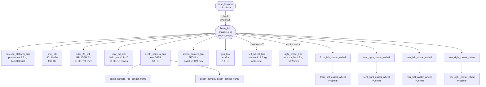

# Anatomia Técnica do Robô (rbot)

> **Para quem é este documento.** Você, engenheiro mecânico. Aqui está
> destrinchada cada peça do robô **como está modelada no código** + qual
> seria o equivalente no robô **real** + como o **software enxerga** cada
> componente. Use junto com [`CODE_GUIDE.md`](CODE_GUIDE.md) (que diz onde
> mudar) e [`RBOT_ANALYSIS.md`](RBOT_ANALYSIS.md) (análise técnica geral).
>
> Última atualização: 2026-05-14
> Caminhos a partir de `/workspace/src/rbot/`.

---

## 1. Visão geral anatômica

### 1.1 O robô numa frase

Diferencial de 2 rodas tracionadas + 4 casters passivos, chassi 50×40×15 cm
(15 kg), plataforma de carga de alumínio 44×32 cm acima, suite de 6 sensores
opt-in (LiDAR 2D, LiDAR 3D, IMU, RGB-D, estéreo, GPS). Tudo modelado em
URDF/xacro, animado pelo Gazebo via plugins, comandado pelo `ros2_control`.

### 1.2 Mapa físico (planta superior, vista de cima — z positivo aponta pra cima)

```
                                      ↑ x (frente)
                                      │
                                      │
                        ┌─────────────┴─────────────┐
                        │       Plataforma carga    │
                        │      (440 × 320 × 20 mm)  │
                        │      z=0.230 m            │
                        └─────────────────────────────┘
                              │ payload_platform_link
                              │ (fixed joint)
                        ┌─────────────────────────────┐
   GPS opt-in           │                             │   LiDAR 3D opt-in
   (cilindro 50×15)     │                             │   (Velodyne VLP-16)
   z=0.35  ☉────────────┤        BASE_LINK            ├──────────────☉  z=0.30
                        │       (chassi 500×400×150)  │
                        │       15 kg                 │
                        │                             │
   IMU             ▒────┤                             ├────▒   Câmera estéreo
   (40×40×20)           │                             │       (140×30×30)
   z=0.08               │                             │       opt-in z=0.13
                        │                             │
   RGB-D Intel D435i ▓──┤                             ├──◯
   (90×25×25)           │                             │      Casters
   z=0.125              │                             │      r=25 mm
   x=0.237              │                             │      passivos
                        │                             │
                        │                             │
                        │  ←—— wheel_separation ——→   │
                        │       0.35 m                │
                        │                             │
                  ◯ ━━━━┿━━━━━━━━━━━━━━━━━━━━━━━━━━━━━┿━━━━ ◯
                  Roda  │                             │   Roda
                  esq.  │       y=+0.175 — y=-0.175   │   dir.
                  r=62.5 mm                               r=62.5 mm
                  m=1.5 kg                                m=1.5 kg
                                      │
                                      └→ y (esquerda)

                  ◯  ◯  ◯  ◯  (4 casters: front_left, front_right,
                                          rear_left, rear_right
                                          em x=±0.20, y=±0.14)
```

LiDAR 2D fica no topo-frontal: `xyz=(0.20, 0.0, 0.18)`.
Centro de massa do chassi: origem do `base_link`, que está a `z=0.0625 m`
do chão (`base_footprint`). Plataforma de carga e sensores são links
filhos do `base_link`.

### 1.3 Diagrama de árvore (TF / parentesco)



### 1.4 Componentes numerados (12 conjuntos)

1. **Chassi (`base_link`)** — caixa estrutural; abriga toda a eletrônica.
2. **Plataforma de carga (`payload_platform_link`)** — placa de alumínio em cima do chassi onde o pallet pousa (atual: placa fixa; futuro: vira o garfo elevador).
3. **Roda tração esquerda (`left_wheel_link`)** + 4. **direita (`right_wheel_link`)** — diferencial. Cada uma com seu motor (real) e seu controlador (sim).
5. **Caster dianteiro esquerdo** + 6. dianteiro direito + 7. traseiro esquerdo + 8. traseiro direito — rodízios passivos com `swivel` + `wheel` joints.
9. **LiDAR 2D (`lidar_2d_link`)** — escaneamento horizontal 360°, principal sensor de navegação.
10. **LiDAR 3D (`lidar_3d_link`)** — escaneamento 3D (opt-in), para perception avançada.
11. **IMU (`imu_link`)** — acelerômetro + giroscópio 3 eixos, 200 Hz.
12. **Câmera RGB-D (`depth_camera_link`)** — Intel RealSense D435i; cor + profundidade; serve para AprilTag e obstáculos próximos.
13. **Câmera estéreo (`stereo_camera_link`)** — par de câmeras com baseline 120 mm (opt-in).
14. **GPS (`gps_link`)** — antena GNSS (opt-in; só faz sentido outdoor).

> Itens 9-14 são todos **toggleáveis** em runtime via args do launch
> (`lidar_3d_enabled:=true`, etc).
> Itens **que não existem ainda**: garfo elevador, motorredutores reais,
> encoders, controlador embarcado, bateria, BMS, botão de e-stop. Ver §5.

---

## 2. Ficha técnica componente a componente

> Convenção de coordenadas (REP-103): **x = frente** (avança), **y = esquerda**, **z = cima**.

### 2.1 Chassi — `base_link`

| Campo | Valor | Onde |
|---|---|---|
| Geometria de colisão | Caixa 0.500 × 0.400 × 0.150 m | `robot/rlai_description/urdf/base/base.urdf.xacro:58` |
| Visual | Mesh `chassis.stl` (escala 0.001) | `base.urdf.xacro:21` |
| Massa | **15.0 kg** | `base.urdf.xacro:63` |
| Tensor de inércia | Ixx=0.2281, Iyy=0.3406, Izz=0.5125 kg·m² | `base.urdf.xacro:71-73` |
| Posição relativa | origem do `base_link`, **0.0625 m** acima do chão (`base_footprint`) | `base.urdf.xacro:13` |
| Offset do collision box | z=+0.075 m (centro do box no eixo do chassi) | `base.urdf.xacro:55` (comentário explica por quê) |
| **No robô real** | Chapa de aço dobrada ou perfil de alumínio estrutural (extrusão 30×30 ou 40×40). Massa real provavelmente 25-40 kg com PCB + cabeamento + estrutura. **Re-calcular inércia depois do CAD.** |

### 2.2 Plataforma de carga — `payload_platform_link`

| Campo | Valor | Onde |
|---|---|---|
| Geometria | Box 0.440 × 0.320 × 0.020 m, centrada em z=0.230 m | `payload_platform.urdf.xacro:23-26` |
| Visual | Mesh `payload_platform.stl` | `payload_platform.urdf.xacro:11` |
| Massa | 2.5 kg | `payload_platform.urdf.xacro:32` |
| Inércia | Ixx=0.02142, Iyy=0.04042, Izz=0.06167 | `payload_platform.urdf.xacro:33-35` |
| Junta | `payload_platform_joint` (fixed) → `base_link` | `payload_platform.urdf.xacro:42-46` |
| **No robô real** | Placa de alumínio 6 mm + 4 colunas de sustentação. **VAI SER SUBSTITUÍDA pelo garfo elevador** (junta `prismatic` em z) — ver `ROADMAP.md §3 Falta fazer`. |

### 2.3 Roda tração esquerda / direita — `left_wheel_link` / `right_wheel_link`

| Campo | Valor | Onde |
|---|---|---|
| Geometria de colisão | Cilindro r=0.0625 m, comprimento (largura) 0.040 m | `wheels.urdf.xacro:41` |
| Visual | Mesh `wheel.stl` + `wheel_cap.stl` | `wheels.urdf.xacro:20-31` |
| Massa por roda | 1.5 kg | `wheels.urdf.xacro:45` |
| Inércia (cilindro maciço) | Ixx=Iyy=0.001665, Izz=0.002930 | `wheels.urdf.xacro:50-52` |
| Posição (origem do joint) | x=0, y=±0.175 (= ±wheel_separation/2), z=0 | `wheels.urdf.xacro:60` |
| Eixo de rotação | y (lateral) | `wheels.urdf.xacro:61` |
| Damping / fricção da junta | damping=0.1, friction=0.05 (atrito viscoso) | `wheels.urdf.xacro:62` |
| **Limite de esforço** | effort=10.0 N·m, velocity=5.0 rad/s | `wheels.urdf.xacro:63` |
| **Limite no ros2_control** | velocity ∈ [-5.0, +5.0] rad/s | `ros2_control.urdf.xacro:31-34` |
| **wheel_separation** | 0.35 m (centerline-to-centerline) | `robot.urdf.xacro:45` + `controllers.yaml:25` |
| **wheel_radius** | 0.0625 m (62.5 mm) | `robot.urdf.xacro:45` + `controllers.yaml:26` |
| **Velocidade linear máx** | 0.5 m/s (≈ 31°/s do robô) | `controllers.yaml:45` |
| **Aceleração máx** | 1.0 m/s² | `controllers.yaml:48` |
| **No robô real** | Motorredutor BLDC **24 V** ~150 W com redução ~20:1 e encoder magnético; alvo 0.5 m/s @ 80 rpm. Pneu maciço de borracha (não inflável, para galpão). Fornecedor candidato: motorredutor de cadeira de rodas (mercado interno), ou kit de patinete/scooter. Encoder: incremental 1024 ppr. **Torque-alvo no eixo:** F = m·a + atrito; carga 15 kg + 500 kg pallet + 1 m/s² → ~50 N por roda; r=0.0625 m → **3.1 N·m por roda**. O `effort=10` do URDF dá folga 3×. |

### 2.4 Casters (4×) — `{front_left,front_right,rear_left,rear_right}_caster_*`

Cada caster tem **dois links**: o `swivel` (eixo vertical livre) e o `wheel`
(eixo lateral livre).

| Campo | Valor | Onde |
|---|---|---|
| Posições dos pivôs | (0.20, ±0.14), (-0.20, ±0.14) | `wheels.urdf.xacro:135-138` |
| Massa swivel | 0.05 kg | `wheels.urdf.xacro:89` |
| Massa wheel | 0.15 kg | `wheels.urdf.xacro:115` |
| Raio wheel | 0.025 m (25 mm) | `wheels.urdf.xacro:99` |
| Largura wheel | 0.020 m | `wheels.urdf.xacro:99` |
| Offset vertical (swivel → wheel) | z=-0.036 m | `wheels.urdf.xacro:128` |
| Atrito junta swivel | damping=0.0005, friction=0.0 (gira fácil) | `wheels.urdf.xacro:104` |
| **No robô real** | Rodízio industrial de poliuretano com rolamento de esferas duplo; ~30 mm de diâmetro; sem motor. Espera-se que o atrito real seja não-trivial — pode causar drift no diferencial. **Item para validar com o CAD.** |

### 2.5 LiDAR 2D — `lidar_2d_link`

| Campo | Valor | Onde |
|---|---|---|
| Modelo simulado | RPLIDAR A3 (default) — Hokuyo UST-20LX como alternativa | `robot.urdf.xacro:18` |
| Geometria | Cilindro r=0.038, h=0.041 (housing); ring r=0.040, h=0.006 | `lidar_2d.urdf.xacro:13-29` |
| Massa | 0.17 kg | `lidar_2d.urdf.xacro:41` |
| Posição no `base_link` | xyz=(**0.20, 0.0, 0.18**), rpy=(0,0,0) | `robot.urdf.xacro:54` |
| Junta | `lidar_2d_joint` (fixed) | `lidar_2d.urdf.xacro:46-50` |
| Tipo Gazebo | `gpu_lidar` | `gazebo_sensors.urdf.xacro:43` |
| Update rate | **15 Hz** | `gazebo_sensors.urdf.xacro:43` |
| Amostras horizontais | **720** raios (0.5° por raio) | `gazebo_sensors.urdf.xacro:49` |
| FOV horizontal | 360° (-π a +π) | `gazebo_sensors.urdf.xacro:50-51` |
| Alcance | 0.30 a 25.0 m | `gazebo_sensors.urdf.xacro:56-58` |
| Resolução de range | 0.01 m (1 cm) | `gazebo_sensors.urdf.xacro:58` |
| Ruído gaussiano | σ = 0.01 m | `gazebo_sensors.urdf.xacro:62` |
| Tópico ROS | `/scan` (`sensor_msgs/LaserScan`) | `gazebo_sensors.urdf.xacro:44` |
| **No robô real** | **RPLIDAR A3** (~US$ 600, 12 m alcance, 15-20 Hz) ou **Hokuyo UST-10LX/20LX** (~US$ 1500, 10-20 m, indústria). Para AMR comercial: SICK nanoScan3 ou LMS1xx (com classificação safety se quiser certificar). Para o nosso modo robô-only: A3 é suficiente. |

### 2.6 LiDAR 3D — `lidar_3d_link` (opt-in)

| Campo | Valor | Onde |
|---|---|---|
| Modelo simulado | Velodyne VLP-16 (default) | `robot.urdf.xacro:19` |
| Geometria | Cilindro r=0.050, h=0.086 | `lidar_3d.urdf.xacro:16` |
| Massa | 0.83 kg | `lidar_3d.urdf.xacro:30` |
| Posição | xyz=(**0.0, 0.0, 0.30**) — topo do chassi | `robot.urdf.xacro:61` |
| Tipo Gazebo | `gpu_lidar` | `gazebo_sensors.urdf.xacro:77` |
| Update rate | 10 Hz | `gazebo_sensors.urdf.xacro:79` |
| Amostras horizontais | 1800 (0.2° por raio) | `gazebo_sensors.urdf.xacro:85` |
| Canais verticais | 16, ±15° | `gazebo_sensors.urdf.xacro:90-94` |
| Alcance | 0.1 a 100 m | `gazebo_sensors.urdf.xacro:97-99` |
| Ruído gaussiano | σ = 0.02 m | `gazebo_sensors.urdf.xacro:103` |
| Tópico ROS | `/lidar_3d/points_raw` (`sensor_msgs/PointCloud2`) | `gazebo_sensors.urdf.xacro:80` |
| **No robô real** | VLP-16 (≈US$ 4000) ou alternativas mais baratas: **Livox Mid-360** (~US$ 800), Ouster OS0/OS1. Para AMR de galpão, **provavelmente NÃO entra** — overkill. Bom para outdoor/robotização agrícola. |

### 2.7 IMU — `imu_link`

| Campo | Valor | Onde |
|---|---|---|
| Geometria | Box 0.04 × 0.04 × 0.02 m | `imu.urdf.xacro:14` |
| Massa | 0.05 kg | `imu.urdf.xacro:27` |
| Posição | xyz=(**0.0, 0.0, 0.08**) — centro do chassi | `robot.urdf.xacro:48` |
| Tipo Gazebo | `imu` | `gazebo_sensors.urdf.xacro:118` |
| Update rate | **200 Hz** | `gazebo_sensors.urdf.xacro:120` |
| Ruído gyro | σ = 3.394e-4 rad/s/√Hz (Bosch BMI085 class) | `gazebo_sensors.urdf.xacro:124-126` |
| Ruído accel | σ = 4e-3 m/s²/√Hz | `gazebo_sensors.urdf.xacro:129-131` |
| Tópico ROS bruto | `/imu/data_raw` (sem orientação, só ωxyz + axyz) | `gazebo_sensors.urdf.xacro:121` |
| Tópico ROS filtrado | `/imu/data` (com quaternion, vindo do filtro Madgwick) | `localization/rlai_localization/launch/...` |
| **No robô real** | **Bosch BMI085** (~US$ 15) — 6-DoF (sem mag) — ou **TDK ICM-42688** (~US$ 5). Para fusão com odom, 100-200 Hz já é luxo. **Não precisa de magnetômetro** para o nosso caso (indoor, mapa fixo). |

### 2.8 Câmera RGB-D — `depth_camera_link`

| Campo | Valor | Onde |
|---|---|---|
| Modelo simulado | Intel RealSense **D435i** | `robot.urdf.xacro:21` |
| Geometria de colisão | Box 0.025 × 0.090 × 0.025 m | `depth_camera.urdf.xacro:18` |
| Visual | Mesh `depth_camera_housing.stl` | `depth_camera.urdf.xacro:14` |
| Massa | 0.072 kg | `depth_camera.urdf.xacro:30` |
| Posição | xyz=(**0.237, 0.0, 0.125**) — frontal | `robot.urdf.xacro:69` |
| FOV horizontal | **87°** (1.5184 rad) | `gazebo_sensors.urdf.xacro:165` |
| Update rate | 30 Hz (depth + RGB independentes) | `gazebo_sensors.urdf.xacro:161/184` |
| Tópicos ROS | `/depth_camera/depth` (depth), `/depth_camera/image_raw` (RGB) | `gazebo_sensors.urdf.xacro:162/185` |
| Frames ópticos | `depth_camera_rgb_optical_frame`, `depth_camera_depth_optical_frame` (REP-103) | `depth_camera.urdf.xacro:48-66` |
| **No robô real** | **Intel D435i** real (US$ 350) ou **D455** (alcance maior). Uso principal **para nós**: AprilTag docking de pallet (alinhar ±2 cm antes de elevar). Detecção de obstáculos baixos (que o LiDAR 2D não vê). |

### 2.9 Câmera estéreo — `stereo_camera_link` (opt-in)

| Campo | Valor | Onde |
|---|---|---|
| Geometria | Box 0.030 × 0.140 × 0.030 m (barra) | `stereo_camera.urdf.xacro:21` |
| Massa | 0.159 kg | `stereo_camera.urdf.xacro:36` |
| Baseline | 0.120 m (offsets ±0.06 m no eixo y) | header do arquivo |
| Update rate | 30 Hz (cada câmera) | `gazebo_sensors.urdf.xacro:272/298` |
| Tópicos | `/stereo/left/image_raw`, `/stereo/right/image_raw` (+ camera_info) | `gazebo_sensors.urdf.xacro:273/299` |
| **No robô real** | **ZED 2** (~US$ 600) ou **OAK-D** (Luxonis, ~US$ 250). Provavelmente **redundante com o D435i** para o nosso caso — manteria só RGB-D. |

### 2.10 GPS — `gps_link` (opt-in)

| Campo | Valor | Onde |
|---|---|---|
| Geometria | Cilindro r=0.025, h=0.015 (antena) | `gps.urdf.xacro:14` |
| Massa | 0.030 kg | `gps.urdf.xacro:26` |
| Tipo Gazebo | `navsat` | `gazebo_sensors.urdf.xacro:216` |
| Update rate | 10 Hz | `gazebo_sensors.urdf.xacro:218` |
| Tópico | `/gps/fix` (`sensor_msgs/NavSatFix`) | `gazebo_sensors.urdf.xacro:219` |
| **No robô real** | u-blox NEO-M9N ou ZED-F9P (RTK). **Não faz sentido indoor.** Só se virar caso outdoor (pátio de carga, expedição externa). Pode ficar desabilitado por enquanto. |

### 2.11 Junta tração esquerda / direita (interface ros2_control)

| Campo | Valor | Onde |
|---|---|---|
| Tipo de junta | `continuous` (sem batente) | `wheels.urdf.xacro:57` |
| Interface de comando | **velocity** (rad/s) — não torque | `ros2_control.urdf.xacro:31-34` |
| Limite ros2_control | min=-5.0, max=+5.0 rad/s | `ros2_control.urdf.xacro:32-33` |
| Limite no URDF (effort) | 10.0 N·m | `wheels.urdf.xacro:63` |
| State interfaces | position + velocity (encoder simulado) | `ros2_control.urdf.xacro:35-36` |
| Controlador | `diff_drive_controller/DiffDriveController` | `controllers.yaml:11` |
| Frequência do loop | 100 Hz | `controllers.yaml:6` |
| **Implicação prática** | Como o controle é por **velocidade**, o motor real precisa ter **driver com loop de velocidade interno** (servo BLDC ou DC com PID embarcado lendo encoder). Não dá pra ligar um motor DC direto num PWM e esperar funcionar — vai ter overshoot/erro. |

### 2.12 Plataforma de controle (sim vs real)

| Modo | Plugin | Onde |
|---|---|---|
| **Gazebo** | `gz_ros2_control/GazeboSimSystem` | `ros2_control.urdf.xacro:14` |
| **Isaac Sim** | `topic_based_ros2_control/TopicBasedSystem` | `ros2_control.urdf.xacro:16-18` |
| **Hardware real** | `rlai_hardware/RlaiSystemHardware` (placeholder — **não existe ainda**) | `ros2_control.urdf.xacro:20-22` |

Mudar de simulação para hardware = trocar o plugin no `<hardware>` do
ros2_control. Topics, controllers, Nav2 — tudo igual.

---

## 3. Como o software "enxerga" o hardware

> Analogia de **fábrica industrial**: pense no software como o sistema
> que controla uma fábrica automatizada.

### 3.1 As camadas como uma fábrica

| Camada de software | Análogo na fábrica | O que faz |
|---|---|---|
| **URDF / Xacro** | **Planta arquitetônica + lista de máquinas** | Diz onde fica cada máquina, qual é a massa, qual é o eixo de rotação. Não move nada — é só descrição. |
| **Meshes (STL)** | **Modelo 3D no SolidWorks da máquina** | Aparência visual. Para colisão usa-se primitivas (cilindro/caixa) por performance. |
| **Gazebo plugins** | **Simulador físico de cada máquina** | "Se eu mandar essa roda girar a 2 rad/s, em quanto tempo o robô chega no canto?" Gazebo resolve a equação de movimento com ODE. Cada sensor tem um plugin que **gera dados sintéticos** como se o sensor real estivesse lá. |
| **`gz_ros2_control` plugin** | **PLC / CLP da fábrica conectado aos motores** | Recebe comando "roda esquerda 1.5 rad/s" do controller, aplica nos joints do Gazebo via API. No robô real é trocado pelo driver do motor (Modbus, EtherCAT, CAN). |
| **`ros2_control` + `diff_drive_controller`** | **Inversor / drive de motor com cinemática inversa** | Recebe `/cmd_vel` (Twist linear + angular) e converte na velocidade de cada roda usando `wheel_separation` e `wheel_radius`. Também integra os encoders pra publicar a odometria. |
| **`velocity_smoother`** | **Rampa de aceleração do inversor** | Pega comandos discretos do Nav2 e suaviza para não tomar choque de aceleração (mesma função do "ramp time" num VFD). |
| **EKF (`robot_localization`)** | **Sensor virtual de pose** (estimador de estado) | Funde encoder + IMU para dar uma única pose suave (`odom → base_footprint`). Igual filtro de Kalman num radar marítimo. |
| **AMCL** | **GPS interno do galpão** | Casa o `/scan` atual com o mapa pré-existente para descobrir onde o robô está (`map → odom`). Probabilístico, baseado em partículas. |
| **SLAM Toolbox** | **Equipe de topografia que mapeia o galpão** | Constrói o mapa enquanto o robô anda. Saída: occupancy grid. Usado uma vez por galpão (mapeamento inicial); depois AMCL toma o lugar. |
| **Nav2** | **Gerente de logística** | Recebe ordem "ir ao ponto X". Planeja rota (planner global SMAC), executa a rota desviando obstáculos (controller local MPPI). Se algo falhar, aciona recuperação (girar, recuar). |
| **Behavior Tree** | **Procedimento operacional padrão** (POP) | Define a sequência: "computar rota → seguir rota → se obstáculo persistente, recuar e re-planejar → se falhar 3×, abortar". XML. |
| **ROS Topics** | **Esteiras transportadoras de informação** | Cada esteira (`topic`) tem **um tipo de coisa só** (`LaserScan`, `Twist`, `Image`). Quem produz (publisher) joga na esteira, quem precisa (subscriber) tira. Várias máquinas podem ler a mesma esteira simultaneamente. |
| **ROS Services / Actions** | **Pedidos formais com confirmação** | Service = "abre a porta" (resposta rápida). Action = "vai até o ponto X" (pode levar minutos, dá feedback de progresso, dá pra cancelar). Nav2 usa actions. |
| **TF tree** | **Sistema de coordenadas global da fábrica** | Cada link tem um frame. A árvore traduz "ponto na frente da câmera" para "ponto no mapa do galpão" automaticamente. |
| **Lifecycle nodes** | **Sequência de partida da fábrica** | Cada nodo Nav2 tem estados: unconfigured → inactive → active. O `lifecycle_manager` acende eles em ordem (servidores antes de quem chama). |

### 3.2 Fluxo de uma missão (analogia "ordem de produção")

```
1. OPERADOR/MISSÃO DISPATCH:
     "Robô, leva pallet X para doca Y."
     → goal NavigateToPose publicado em /goal_pose

2. NAV2 BEHAVIOR TREE (POP):
     → chama o planner global (SMAC)

3. PLANNER SERVER (engenheiro de roteiro):
     consulta o global_costmap (planta com obstáculos)
     produz uma sequência de waypoints (x,y,θ)
     publica em /plan

4. CONTROLLER SERVER (operador da empilhadeira):
     pega o /plan + o local_costmap (último 3×3 m visto)
     MPPI amostra 2000 trajetórias futuras de 2.8 s
     escolhe a de menor custo
     publica /cmd_vel (vx, wz)

5. VELOCITY SMOOTHER (rampa de partida):
     aceita /cmd_vel, limita aceleração
     publica /diff_drive_controller/cmd_vel

6. DIFF_DRIVE_CONTROLLER (inversor):
     converte (vx, wz) em (ω_esq, ω_dir) pela cinemática inversa diff-drive
     escreve nas command_interfaces dos joints

7. gz_ros2_control (PLC):
     traduz para o Gazebo "rode esses joints a essas velocidades"

8. GAZEBO (mundo físico):
     aplica torque, calcula colisão, atualiza pose, gera dados de sensor

9. ESTADO DE VOLTA:
     encoders simulados → /joint_states → ros2_control
     odometria → /diff_drive_controller/odom → EKF
     LiDAR → /scan → AMCL + costmaps
     EKF + AMCL → TF (map→odom→base_footprint) → Nav2

[loop a 20 Hz no controller, 100 Hz no controller_manager]
```

---

## 4. Sincronização: quando mudo o hardware, o que mais muda?

**Regra de ouro**: número físico aparece em mais de um lugar. Mudar num
só causa **bug silencioso** (sim funciona, mas odometria/Nav2 mente).

| Mudei o hardware… | Mexer em (camada URDF) | Mexer em (camada controle) | Mexer em (camada Nav2) |
|---|---|---|---|
| Raio da roda | `robot.urdf.xacro:45` + recálculo inércia em `wheels.urdf.xacro:50-52` | `controllers.yaml:26` (wheel_radius) | — (Nav2 usa odom já corrigida) |
| Wheel separation | `robot.urdf.xacro:45` | `controllers.yaml:25` | — |
| Massa do chassi | `base.urdf.xacro:63` + inércia em `:71-73` | — | — (mas afeta aceleração real → talvez baixar `max_accel`) |
| Velocidade máxima do motor | `wheels.urdf.xacro:63` (effort/velocity) + `ros2_control.urdf.xacro:32-33` | `controllers.yaml:45` | `nav2_params.yaml:48` (vx_max do MPPI) |
| Footprint mudou (chassi maior) | `base.urdf.xacro:58` | — | `nav2_params.yaml:218` + `:274` (footprint nos dois costmaps) |
| Mudei o LiDAR (alcance) | — | — | `nav2_params.yaml:235-237/285-287` (raytrace_max_range), `amcl.yaml:33` |
| Mudei a IMU (taxa) | `gazebo_sensors.urdf.xacro:120` | (talvez `imu_filter.yaml` gain) | — |
| Adicionei garfo (nova junta) | criar `fork.urdf.xacro` + incluir em `robot.urdf.xacro` | adicionar `JointPositionController` em `controllers.yaml` + interface em `ros2_control.urdf.xacro` | — (a menos que o footprint mude carregando pallet → `dynamic_footprint`) |

---

## 5. O que **não existe** no rbot (e a gente precisa quando for hardware real)

Estes são os "buracos" pra você, engenheiro mecânico, planejar:

| Faltando | Descrição | Onde vai entrar |
|---|---|---|
| **Garfo elevador** | Junta `prismatic` em z, curso 0.00-0.20 m. Atuador linear (fuso de esferas + motor passo, ou cilindro elétrico). Carrega pallet de até 500 kg. | Novo `fork.urdf.xacro` + `JointPositionController` em `controllers.yaml`. **Ver ROADMAP §3.** |
| **Motorredutores reais** | Modelo BLDC ou DC + redutor. Sizing: 50 N por roda → 3 N·m no eixo após redução. Encoder 1024 ppr mínimo. | Driver real substitui o plugin Gazebo. |
| **Driver de motor** | Inversor / driver com loop de velocidade interno. ODrive, Roboteq, ou inversor industrial chinês 24 V. | Plugin `rlai_hardware/RlaiSystemHardware` (a implementar). |
| **Bateria + BMS** | Tipicamente LFP 24 V 100-200 Ah (autonomia 4-8 h). BMS publicaria estado em `/battery_state`. | Tópico ROS `sensor_msgs/BatteryState`. |
| **Computador embarcado** | Jetson Orin Nano (US$ 500) ou mini-PC Intel NUC com Ubuntu 24.04. Precisa rodar Nav2 + AMCL + (futuramente) detecção AprilTag em tempo real. | (Não aparece no URDF — é "casca" do robô.) |
| **Botão de e-stop / safety relays** | Físico, redundante, corta alimentação dos motores. Modo robô-only reduz exigência mas **não elimina**. | Hardware puro; só publica `/emergency_stop` em ROS. |
| **Carregamento autônomo** | Estação de docking com contato + sensor de bateria + behavior tree de "low-battery → return to dock". | ROADMAP §5 (backlog). |
| **Sinalização luminosa robô-ativo** | Luz vermelha / sirene quando o AMR está em operação. Política do modo robô-only. | Bridge ROS → relé. |

---

## 6. Próximos passos pro engenheiro mecânico

Sugerido para alinhar com o ROADMAP:

1. **Validar dimensões fundamentais** — chassi 500×400×150 mm com 15 kg é suficiente para 500 kg de pallet? Refazer no SolidWorks, recalcular tensores de inércia.
2. **Modelar o garfo elevador** — curso 200 mm, peso vazio 8-15 kg estimado, motor passo NEMA 23 + fuso de esferas Ø16 passo 5 mm. **Saída**: STL + parâmetros para o `fork.urdf.xacro`.
3. **Sizing dos motores tração** — confirmar 24 V × 150 W com redução 20:1 cobre o pior caso (500 kg em rampa de 2°). Selecionar fornecedor.
4. **Distribuição de massa** — onde vai a bateria, o computador, o conversor DC-DC? Afeta CG e inércia. Recalcular.
5. **Sensorial** — confirmar que só RGB-D + LiDAR 2D + IMU cobre todos os casos de uso (mantemos LiDAR 3D, estéreo, GPS desabilitados por enquanto). Documentar racional.

Cada um desses items vai virar uma decisão no [`ROADMAP.md §6`](../ROADMAP.md).
