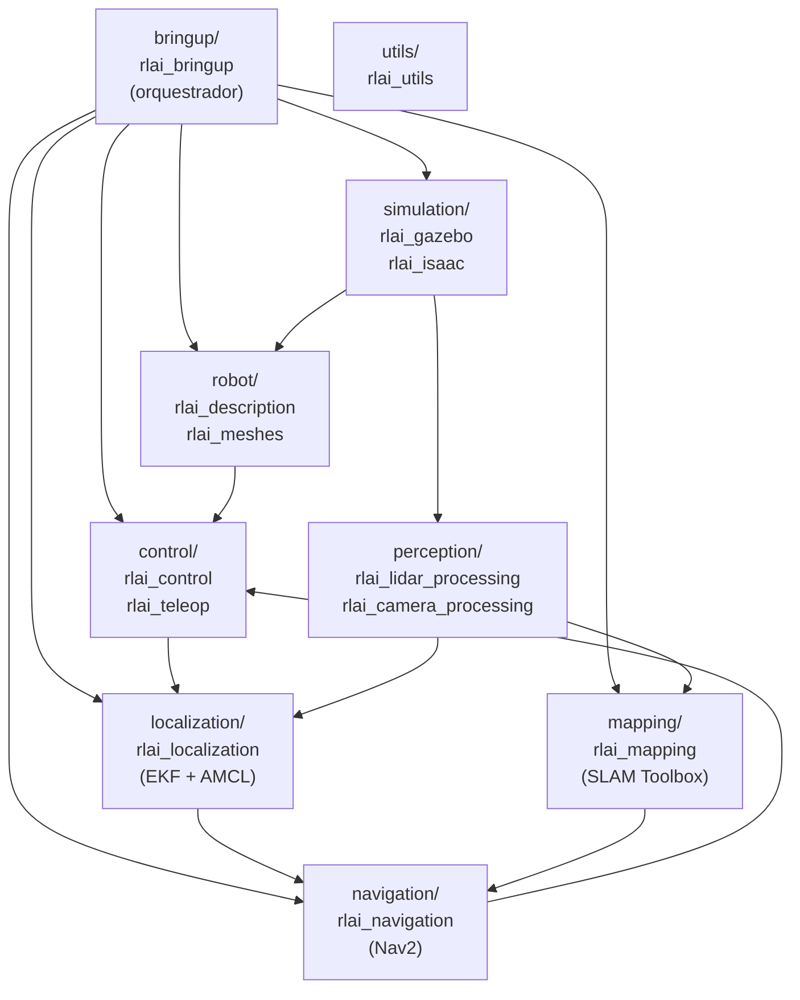
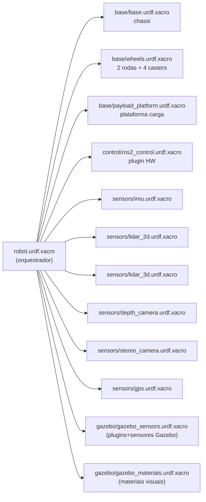
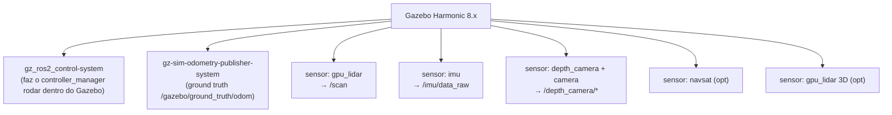
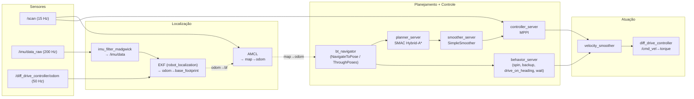
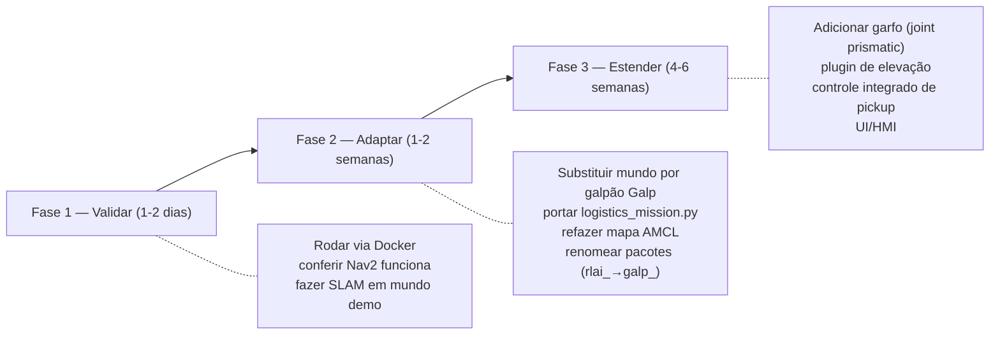

# Análise técnica do projeto **rbot**

> **Documento didático para engenheiro mecânico aprendendo robótica ROS 2.**
> Data: 2026-05-13
> Repositório analisado: `/workspace/rbot` (clonado da Robolabs AI / RLXAI).
> Comparação: `/workspace/amr_pallet` (nosso protótipo atual — ver `docs/ROBOT_ANALYSIS.md`).

---

## Resumo executivo (1 minuto)

O `rbot` é uma **stack AMR de referência completa**, escrita por uma empresa indiana (Robolabs AI) sob Apache 2.0, com tudo que falta no nosso `amr_pallet`:

- URDF/Xacro real, com inércias calculadas, juntas, rodas que giram, casters que rolam
- Plugins Gazebo Harmonic 8.x bem configurados (LiDAR, IMU, câmera RGB-D, GPS, ground truth)
- `ros2_control` com `diff_drive_controller` real (não dead reckoning fake)
- Nav2 moderno: planner SMAC Hybrid-A* + controller MPPI (não DWB de 2019)
- SLAM Toolbox configurado para galpão (filtros anti-aliasing de corredor)
- EKF (`robot_localization`) fundindo odometria + IMU
- AMCL configurado para localização contra mapa salvo
- Docker Compose, Dev Container, CI no GitHub
- Documentação interna (`docs/architecture/overview.md`) com Mermaid

**Recomendação sintética**: **vale a pena partir dele**, mas como **base técnica/educacional**, não como produto final. Detalhes na §7.

---

## 1. Estrutura do repositório (pacotes ROS 2)

### 1.1 Visão geral



### 1.2 Tabela de pacotes (13 pacotes)

| Pacote | Tipo | Função | Análogo industrial |
|---|---|---|---|
| `rlai_description` | `ament_cmake` | URDF/Xacro modular do robô + RViz config | Desenho CAD do equipamento |
| `rlai_meshes` | `ament_cmake` | STLs (chassi, roda, câmera, logos) | Biblioteca de peças do CAD |
| `rlai_gazebo` | `ament_cmake` | Mundos `.sdf` + ponte ROS↔Gazebo | Modelo de simulação CAE |
| `rlai_isaac` | `ament_python` | Stub para integração futura com Isaac Sim | (placeholder) |
| `rlai_control` | `ament_cmake` | Configuração do `diff_drive_controller` | Drive parametrizado do servo |
| `rlai_teleop` | `ament_python` | Teleop joystick + serviço de **e-stop** | Botoeira de homem morto |
| `rlai_lidar_processing` | `ament_cmake` | Filtro de altura + voxel downsampling 3D | Pré-processamento de LiDAR |
| `rlai_camera_processing` | `ament_cmake` | Disparidade estéreo + nuvem de pontos profundidade | Processamento de visão |
| `rlai_localization` | `ament_python` | EKF + AMCL + filtro IMU Madgwick | Encoder absoluto + IMU industrial |
| `rlai_mapping` | `ament_python` | SLAM Toolbox (online async + lifelong) | Mapeamento por LiDAR (cartografia) |
| `rlai_navigation` | `ament_python` | Nav2 (SMAC + MPPI + behavior trees + ação) | Sistema de gestão de frota / supervisório |
| `rlai_bringup` | `ament_python` | Launch top-level que liga tudo | Sequência de partida da máquina |
| `rlai_utils` | `ament_python` | Stub de utilidades compartilhadas | (placeholder) |

> **Comparação industrial**: equivalente a um catálogo de módulos onde cada pacote é uma "carta" do esquema elétrico — cada um faz uma coisa só, comunica com os outros por interface bem definida (tópicos ROS 2 = sinais elétricos).

### 1.3 Ferramental do repositório

| Item | Onde | Função |
|---|---|---|
| Docker + Compose | `docker/Dockerfile.gazebo`, `docker-compose.yml` | Build reproduzível em qualquer máquina |
| Dev Container VS Code | `.devcontainer/` | Abrir o projeto direto no VS Code com tudo instalado |
| CI GitHub Actions | `.github/workflows/ci.yml` | Lint + build + teste automático em cada PR |
| `pre-commit` | `.pre-commit-config.yaml` | Roda `clang-format`, `flake8` antes do commit |
| `colcon.meta` | raiz | Configuração centralizada do build colcon |
| `rosdep.yaml` | raiz | Dependências de sistema declaradas |
| `scripts/run_sim.sh` | scripts | Atalho com flags `--headless`, `--rviz`, `--rviz-nav` |
| `scripts/build.sh`, `install_deps.sh` | scripts | Build nativo Ubuntu 24.04 |
| `scripts/generate_meshes.py` | scripts | Gera STLs paramétricas |

---

## 2. URDF/Xacro do robô

### 2.1 Arquitetura modular do URDF



Cada arquivo é um **macro Xacro** parametrizado. Habilita-se sensor por argumento de launch (ex. `lidar_3d_enabled:=true`).

### 2.2 Dimensões físicas (robô completo)

| Item | Valor | Onde no arquivo |
|---|---|---|
| **Chassi (bounding-box collision)** | 0.50 × 0.40 × 0.15 m | `base/base.urdf.xacro:55-59` |
| Massa do chassi | 15.0 kg | `base/base.urdf.xacro:63` |
| Inércia do chassi (Ixx, Iyy, Izz) | 0.2281 / 0.3406 / 0.5125 kg·m² | `base/base.urdf.xacro:71-73` (calculadas pelo autor: m·(b²+c²)/12) |
| **Roda motriz (raio × espessura)** | 0.0625 m × 0.040 m (∅125 × 40 mm) | `base/wheels.urdf.xacro:41` |
| Massa por roda motriz | 1.5 kg | `base/wheels.urdf.xacro:45` |
| **Bitola (wheel separation)** | 0.35 m (centro-a-centro) | `robot.urdf.xacro:45` |
| **Caster (raio × espessura)** | 0.025 m × 0.020 m | `base/wheels.urdf.xacro:107` |
| Posição dos 4 casters | (±0.20, ±0.14) m | `base/wheels.urdf.xacro:132-135` |
| Massa por caster (swivel + wheel) | 0.05 + 0.15 kg | `base/wheels.urdf.xacro:89, 115` |
| Footprint Nav2 | retângulo (−0.28..0.28, −0.23..0.23) m + padding 0.03 | `nav2_params.yaml:218,274` |
| Spawn no Gazebo | (1.0, 1.0, 0.1) m | `simulation.launch.py:60-62` |

> **Comparação CAD**: ao contrário do `amr_pallet` (rodas soltas, cosméticas), aqui temos **6 rodas reais** com colisão cilíndrica, atrito modelado, juntas continuous publicando estado em `/joint_states`. É um modelo multibody dinâmico funcional.

### 2.3 Juntas (cinemática real)

| Junta | Tipo | Eixo | Pais → Filho | Limites |
|---|---|---|---|---|
| `base_footprint_joint` | fixed | — | `base_footprint` → `base_link` | offset 0.0625 m em z (centro do chassi acima do solo) |
| `left_wheel_joint` | continuous | y | `base_link` → `left_wheel_link` | effort 10 N·m, velocity 5 rad/s, damping 0.1, friction 0.05 |
| `right_wheel_joint` | continuous | y | idem | idem |
| `*_caster_swivel_joint` (×4) | continuous | z | `base_link` → swivel | damping 0.0005 |
| `*_caster_wheel_joint` (×4) | continuous | y | swivel → wheel | damping 0.0005 |
| 6 sensor mounts (`lidar_2d_joint`, `imu_joint`, etc.) | fixed | — | `base_link` → `*_link` | rígidas |

> **Mecanicamente**: as duas rodas motrizes (∅125 mm) são acionadas em velocidade pelo `diff_drive_controller`; os 4 casters passivos giram livres em swivel + roll. É a topologia clássica de empilhadeira AMR: tração diferencial central + apoio passivo nas pontas.

### 2.4 Sensores

| Sensor | Tipo Gazebo | Posição (x,y,z) | Tópico | Taxa | Notas |
|---|---|---|---|---|---|
| 2D LiDAR (RPLIDAR A3) | `gpu_lidar` | (0.20, 0, 0.18) m | `/scan` | **15 Hz** | 720 raios, 360°, alcance 0.30–25 m, σ=0.01 m |
| 3D LiDAR (Velodyne VLP-16) — opcional | `gpu_lidar` | (0, 0, 0.30) m | `/lidar_3d/points_raw` | **10 Hz** | 16 canais ±15°, 1800 raios horiz., alcance 0.1–100 m, σ=0.02 m |
| IMU (MPU-6050/ICM-42688) | `imu` | (0, 0, 0.08) m | `/imu/data_raw` | **200 Hz** | Gyro σ=3.4·10⁻⁴ rad/s/√Hz, accel σ=4·10⁻³ m/s²/√Hz |
| Câmera RGB-D (RealSense D435i) | `depth_camera` + `camera` | (0.237, 0, 0.125) m | `/depth_camera/depth`, `/depth_camera/image_raw` | **30 Hz** | 640×480, FOV 87° (HFoV 1.5184 rad), clip 0.1–10 m (depth) |
| Câmera estéreo (ZED 2) — opcional | 2× `camera` | (0.25, 0, 0.13) m | `/stereo/{left,right}/image_raw` | **30 Hz** | 1280×720, baseline 0.12 m |
| GPS — opcional | `navsat` | (0, 0, 0.35) m | `/gps/fix` | **10 Hz** | σ_pos=2.5 m, σ_vel=0.05 m/s |
| Ground truth odom | `gz-sim-odometry-publisher-system` | base_footprint | `/gazebo/ground_truth/odom` | **50 Hz** | Sem ruído (referência absoluta) |

> **Comparação industrial**: equivalente à instrumentação de uma empilhadeira AGV de fábrica moderna — falta apenas os sensores específicos do garfo (load cell, encoder de elevação). O LiDAR 2D fica na altura típica de 180 mm, condizente com SICK/Hokuyo industriais.

### 2.5 Plugins Gazebo Harmonic carregados



Cada plugin é declarado em `gazebo/gazebo_sensors.urdf.xacro` dentro de blocos `<gazebo>` ROS 2 nativos. **Sem plugin de física custom** — usa o motor padrão `gz-sim-physics-system` do Gazebo (DART por baixo) com fricção `mu1=1.0/mu2=0.5` nas rodas e `0.01/0.01` nos casters.

> **Diferença chave vs amr_pallet**: o `amr_pallet` desativa a gravidade (`<gravity>false</gravity>`) e move o robô teleportando via `set_pose`. O `rbot` deixa a física rodar de verdade — o robô "anda" porque as rodas geram torque, friccionam contra o chão, e o chassi conserva momento. Isso é fundamental para validar tração, derrapagem em curva, comportamento em rampa.

---

## 3. Stack de navegação

### 3.1 Pipeline completa



### 3.2 Componentes Nav2 — tabela técnica

| Componente | Plugin | Parâmetros chave | Onde |
|---|---|---|---|
| **Global planner** | `nav2_smac_planner::SmacPlannerHybrid` | `minimum_turning_radius=0.25 m`, `angle_quantization_bins=72` (5°/bin), `reverse_penalty=2.0`, `max_planning_time=5.0 s`, `allow_unknown=true` | `nav2_params.yaml:138-171` |
| **Local controller** | `nav2_mppi_controller::MPPIController` | horizon `time_steps=56` × `model_dt=0.05 s` = **2.8 s lookahead**; `batch_size=2000` trajetórias; `vx_max=0.5 m/s`, `wz_max=1.9 rad/s`; **8 critics** (Constraint, Cost, Goal, GoalAngle, PathAlign, PathFollow, PathAngle, PreferForward) | `nav2_params.yaml:40-127` |
| **Smoother** | `nav2_smoother::SimpleSmoother` | `tolerance=1e-10`, `max_its=1000` | `nav2_params.yaml:181-185` |
| **BT navigator** | `NavigateToPose` + `NavigateThroughPoses` | `bt_loop_duration=10 ms`, 4 BT XMLs disponíveis | `nav2_params.yaml:376-407` |
| **Recovery** | `Spin`, `BackUp`, `DriveOnHeading`, `Wait` | `simulate_ahead_time=2.0 s`, `max_rotational_vel=1.0 rad/s` | `nav2_params.yaml:328-364` |
| **Costmap global** | static + obstacle + inflation | `resolution=0.05 m`, `inflation_radius=0.55 m`, `update_frequency=1.0 Hz` | `nav2_params.yaml:205-248` |
| **Costmap local** | obstacle + inflation (rolling 3×3 m) | `update_frequency=5.0 Hz`, `publish_frequency=2.0 Hz` | `nav2_params.yaml:254-299` |
| **Waypoint follower** | `WaitAtWaypoint` | `loop_rate=20 Hz`, `stop_on_failure=false` | `nav2_params.yaml:189-199` |

> **Tradução para mecânico**: SMAC Hybrid-A* é como o algoritmo de pathfinding de um GPS de carro — gera caminho considerando que você tem **raio de viragem mínimo** (não pode girar 90° sem velocidade), e penaliza dar marcha-ré. MPPI (Model Predictive Path Integral) é controle preditivo: a cada 50 ms ele simula 2000 trajetórias possíveis para os próximos 2.8 s, dá uma nota a cada uma (8 critérios), e aplica a média ponderada — tipo um piloto que vê 2000 futuros e escolhe o melhor compromisso a cada piscar.

### 3.3 Mapeamento (SLAM Toolbox)

| Parâmetro | Valor | Significado |
|---|---|---|
| Modo | `online async` (mapeia em tempo real) | Atualiza enquanto navega |
| Solver | Ceres + Levenberg-Marquardt + Huber loss | Otimização robusta a outliers |
| Scan topic | `/scan` (LiDAR 2D, 15 Hz) | Entrada principal |
| Faixa de uso | 0.30–12.0 m | Filtra retornos do próprio robô |
| Resolução do mapa | 0.05 m/cell (5 cm) | Padrão Nav2 |
| Loop closure | habilitado, `min_response_fine=0.65` | Fechamento conservador para evitar mapa "torto" em corredor longo |
| Movimento mínimo p/ atualizar | 0.3 m ou 0.3 rad | Reduz CPU em paradas |

Há também `slam_toolbox_lifelong.yaml` para modo "vitalício" (mantém mapa atualizado durante operação produtiva — útil em galpão que muda layout).

### 3.4 Localização (EKF + AMCL)

**EKF (`robot_localization`)** — `ekf.yaml`:
- Funde `/diff_drive_controller/odom` (x, y, yaw, vx, ωz) + `/imu/data` (ωz do gyro + ax, ay)
- Publica `odom → base_footprint` (smoothed)
- **Não funde orientação absoluta** do IMU para evitar descontinuidades em chão plano

**AMCL (`nav2_amcl`)** — `amcl.yaml`:
- 500–2000 partículas (KLD adaptive)
- Modelo `likelihood_field`, 60 beams (subamostrado de 720)
- σ_hit=0.2 m, alpha 0.2/0.2/0.2/0.2 (ruído modelo de movimento)
- Publica `map → odom`
- Pose inicial fixada em (1.0, 1.0, 0°) — bate com spawn do Gazebo

> **Cadeia TF intencionalmente segregada**: cada nó publica **uma única** transformada (EKF: odom→base_footprint, AMCL ou SLAM: map→odom, Robot State Publisher: links). Isto evita o erro clássico de duplo publisher que travava Nav2 em projetos antigos.

---

## 4. Compatibilidade com ROS 2 Jazzy + Gazebo Harmonic

### 4.1 Stack alvo declarada

| Camada | Versão alvo |
|---|---|
| OS | Ubuntu 24.04 LTS Noble |
| ROS 2 | **Jazzy Jalisco** |
| Gazebo | **Harmonic** (`gz-harmonic`, gz-sim 8.x) |
| Middleware | CycloneDDS (`RMW_IMPLEMENTATION=rmw_cyclonedds_cpp`) |
| Python | 3.12 (vem com Noble) |

### 4.2 Pacotes ROS Jazzy usados (via `apt`)

Confirmados no `Dockerfile.gazebo` e `install_deps.sh`:

```
ros-jazzy-ros-base
ros-jazzy-ros-gz                    # ponte ROS↔Gazebo Harmonic
ros-jazzy-gz-ros2-control           # controller_manager dentro do Gazebo
ros-jazzy-ros2-control / -controllers
ros-jazzy-nav2-bringup
ros-jazzy-nav2-mppi-controller
ros-jazzy-nav2-smac-planner
ros-jazzy-slam-toolbox
ros-jazzy-robot-localization
ros-jazzy-imu-filter-madgwick
ros-jazzy-teleop-twist-{joy,keyboard}
ros-jazzy-rmw-cyclonedds-cpp
ros-jazzy-pcl-ros
ros-jazzy-image-transport / -proc / depth-image-proc
ros-jazzy-stereo-image-proc
ros-jazzy-cv-bridge
ros-jazzy-topic-based-ros2-control  # para futura integração Isaac
```

### 4.3 Aderência a APIs específicas Jazzy

| Item | Detalhe Jazzy-específico | Onde |
|---|---|---|
| `diff_drive_controller` | exige `TwistStamped` na entrada | `nav2_params.yaml:8` (`enable_stamped_cmd_vel: true`) |
| `velocity_smoother` | recebe TwistStamped do Nav2 | pipeline de cmd_vel |
| `behavior_server` | mesmo `enable_stamped_cmd_vel: true` | `nav2_params.yaml:331` |
| `bt_navigator` | precisa `error_code_names` (Jazzy suprime warnings) | `nav2_params.yaml:402-407` |
| Plugin `gz_ros2_control` | `gz_ros2_control/GazeboSimSystem` | `urdf/control/ros2_control.urdf.xacro:15` |
| Plugins Gazebo | `gz-sim-...-system` (não `libgazebo_*` antigo) | `gazebo_sensors.urdf.xacro` |
| Sensor `<sensor>` em SDFormat 1.11 | `gz_frame_id`, `<topic>`, etc. | `gazebo_sensors.urdf.xacro` |

> **Conclusão de compatibilidade**: ✅ **100% nativo Jazzy + Harmonic**. Não há resíduo de Foxy/Humble nem Gazebo Classic 11. Comparado ao nosso `amr_pallet` (que usa Gazebo Harmonic mas via plugins manuais e fakes), o `rbot` está alinhado com a documentação oficial Nav2 Jazzy.

### 4.4 Mundos Gazebo disponíveis

| Mundo | Linhas | Uso |
|---|---|---|
| `empty.sdf` | (curto) | Bringup inicial / debug |
| `small_warehouse.sdf` | 474 | Galpão pequeno (default) |
| `large_warehouse.sdf` | 548 | Galpão grande |
| `office_floor.sdf` | — | Escritório |
| `outdoor_courtyard.sdf` | — | Externo (uso de GPS) |

Mapas pré-construídos em `maps/`: `empty_world`, `small_warehouse`, `my_map` — cada um com `.pgm` (occupancy) + `.yaml`.

---

## 5. Comparação com nosso `amr_pallet`

### 5.1 Visão lado-a-lado

| Categoria | `amr_pallet` (nosso) | `rbot` |
|---|---|---|
| **Modelo do robô** | SDF cosmético (caixa + cilindros soltos), `gravity=false` | URDF/Xacro modular, juntas reais, inércias calculadas |
| **Massa** | 10 kg declarados, **ignorados** | 15 kg + 2×1.5 kg rodas + 4×0.2 kg casters, **usados pela física** |
| **Rodas** | 2 cilindros visuais sem joint | 2 motrizes (continuous, axis y, eff 10 N·m) + 4 casters passivos com swivel + roll |
| **Atrito** | inexistente | μ₁=1.0/μ₂=0.5 nas rodas, 0.01 nos casters; kp/kd configurados |
| **Atuação** | `robot_sim.py` integra `cmd_vel` por dead reckoning | `gz_ros2_control` + `diff_drive_controller` → torque real nas juntas |
| **Odometria** | gerada do `/cmd_vel` (sem erro) | wheel encoders → `/diff_drive_controller/odom` → EKF fundindo IMU |
| **LiDAR** | LaserScan **fake**: todos raios = inf | `gpu_lidar` Gazebo: 720 raios reais, ruído Gaussiano σ=0.01 m, raycast no mundo |
| **IMU** | inexistente | `gz-sim-imu-system`, 200 Hz, ruído realista, fundido no EKF |
| **Câmera** | inexistente | RealSense D435i (RGB+depth, 30 Hz, 640×480, FOV 87°) |
| **GPS** | inexistente | NavSat opcional (σ=2.5 m) |
| **3D LiDAR** | inexistente | Velodyne VLP-16 opcional |
| **Stereo** | inexistente | par 1280×720 opcional |
| **Localização** | apenas TF identidade `map→odom` | EKF (`robot_localization`) + AMCL configurado |
| **SLAM** | inexistente | SLAM Toolbox online async + lifelong configurados |
| **Planner global** | DWB-pré-Nav2 ou básico | **SMAC Hybrid-A*** (kinodynamic, raio mínimo) |
| **Controller local** | DWB | **MPPI** (model predictive, 2000 trajetórias/ciclo) |
| **Behavior trees** | padrão Nav2 | 4 BT customizadas (`navigate_to_pose`, `_with_replanning`, `_and_recover`, `multi_waypoint_patrol`) |
| **Recovery behaviors** | padrão | `Spin + BackUp + DriveOnHeading + Wait` configuradas |
| **Costmaps** | básico | global+local separados, footprint poligonal real, raytrace_min_range filtrando ego-points |
| **Teleop + e-stop** | inexistente | joystick + serviço `/e_stop` |
| **Empacotamento** | 1 pacote monolítico (`amr_pallet`) | 13 pacotes especializados |
| **Docker** | inexistente | Dockerfile + Compose + Dev Container |
| **CI** | inexistente | GitHub Actions com lint+build+teste |
| **Documentação** | nenhuma interna | `docs/architecture/overview.md` com Mermaid + README com diagramas |
| **Linhas de config Nav2** | ≈200 | **414 linhas, comentadas** |
| **Linhas de config EKF** | 0 | 104, com matrizes Q e P0 explicadas |

### 5.2 O que **ganhamos** ao adotar `rbot`

1. **Modelo físico real**: agora sim podemos avaliar tração, escorregamento, comportamento em rampa, dinâmica de viragem. Antes era impossível.
2. **Sensores realistas com ruído** — base para validar robustez de Nav2 sob LiDAR ruidoso.
3. **EKF de produção** — fusão odom+IMU corrige escorregamento de roda em curva.
4. **Planner moderno** (SMAC Hybrid-A* + MPPI) — ordens de magnitude mais qualidade que DWB.
5. **Modularidade Xacro** — habilitar/desabilitar 3D LiDAR, GPS, estéreo por flag de launch.
6. **Recovery behaviors funcionais** — robô sai de armadilhas em vez de travar.
7. **Workflow Docker + CI** — onboarding de novo dev em minutos, não dias.
8. **Documentação interna** — arquitetura, sensores, tutoriais.
9. **Múltiplos mundos** — pequeno/grande galpão, escritório, outdoor.
10. **License Apache 2.0** — uso comercial liberado.

### 5.3 O que **perdemos** ou complica

| Aspecto | Custo |
|---|---|
| **Curva de aprendizado** | 13 pacotes para entender vs 1 monolítico — é mais para ler antes de mexer |
| **Tempo de build** | Compilar 13 pacotes leva ~3-5 min na primeira vez |
| **Footprint Docker** | Imagem fica em ~3-4 GB (ROS Jazzy + Gazebo + Nav2 + perception) |
| **Lock no Jazzy/Harmonic** | Não roda em Humble nem Gazebo Classic 11 — força upgrade do host |
| **Domínio do robô** | É um AMR genérico, **sem garfo nem mecanismo de elevação de pallet** — temos que estender se quisermos virar empilhadeira |
| **Identidade visual** | Trazem logo "Robolabs/AI" gravado no chassi (inertes, mas presentes) |
| **Mapas atuais** | `galp_amr.yaml` do `amr_pallet` não vai bater — temos que regenerar via SLAM |
| **Lógica de missão** | Nosso `logistics_mission.py` (sequência de pallets) não está aqui — manter separado |
| **Sem mundo Galp** | nosso galpão real não está modelado — é trabalho de portar SDF |

### 5.4 Comparativo de "esforço para virar produto"

| Tarefa | A partir de `amr_pallet` | A partir de `rbot` |
|---|---|---|
| Adicionar inércia, juntas, atrito | Reescrever URDF do zero | ✅ já existe |
| Trocar planner para SMAC | Reescrever Nav2 params | ✅ já existe |
| Fundir IMU+odom no EKF | Adicionar `robot_localization` + tunar | ✅ já existe |
| Mapear galpão real via SLAM | Adicionar SLAM Toolbox + tunar | ✅ já existe (rodar em galpão real) |
| Adicionar garfo + atuador de elevação | Estender URDF + adicionar joint prismatic + plugin | Estender URDF + adicionar joint prismatic + plugin (mesma dificuldade) |
| Modelar mundo Galp (galpão real) | Já temos `galp_amr.world` parcial | Portar para Harmonic SDFormat 1.11 |
| Lógica de missão (pickup-deliver) | Já temos `logistics_mission.py` | Trazer arquivo para `rlai_navigation` |

---

## 6. Qualidade da documentação

### 6.1 O que existe

| Documento | Tamanho | Qualidade |
|---|---|---|
| `README.md` (raiz) | 14.8 kB | **Muito boa**: badges, vídeo demo embed, tabelas de stack, quick-start Docker, common workflows, troubleshooting, roadmap |
| `docs/architecture/overview.md` | (médio) | **Boa**: diagrama Mermaid system-level, package map, data flow table |
| `docs/sensors/` | vazio | ❌ apenas placeholder |
| `docs/tutorials/` | vazio | ❌ apenas placeholder |
| `CONTRIBUTING.md` | 4 kB | Workflow de PR, padrões de código |
| `docs/assets/` | logo + screenshots | OK |
| Comentários no código | densos, didáticos (ver `gazebo_sensors.urdf.xacro` com seções `═════`) | **Excelente** |

### 6.2 Pontos fortes da documentação

- **Comentários inline pedagógicos**: cada bloco `<gazebo>` explica o que faz, taxa, tópico, frame.
- **TF ownership documentada**: README §"Architecture Notes / TF ownership" deixa claro quem publica cada transformada — isso evita o erro #1 de iniciante em ROS 2.
- **Avisos de armadilha**: README destaca "do not enable mapping_enabled and use_amcl together".
- **Troubleshooting com receitas**: `xhost +local:docker`, "source install/setup.bash", "valid map file".
- **Fórmulas de inércia exibidas**: ex. `Ixx = m(b²+c²)/12 = 15×(0.16+0.0225)/12 = 0.2281` em comentário do URDF.

### 6.3 Pontos fracos

- `docs/sensors/` e `docs/tutorials/` **vazios** — só `.gitkeep`.
- Não há tutorial passo-a-passo "minha primeira missão Nav2".
- Sem documentação de calibração de sensores.
- Sem benchmarks publicados (apesar do roadmap citar "expanded benchmarks").
- Sem CHANGELOG.

### 6.4 Nota global

**8/10** — bem acima da média de projetos open source ROS. Documentação enxuta mas correta, foco em onboarding rápido. Os placeholders vazios pesam, mas o que existe está bem feito.

---

## 7. Recomendação: vale a pena partir dele?

### 7.1 Resposta direta

**Sim, vale.** É de longe a melhor base AMR ROS 2 Jazzy + Gazebo Harmonic open source que vimos. **Mas adote como esqueleto, não como produto pronto.** Há trabalho de adaptação porque:
1. Não tem mecanismo de elevação de pallet (essência do nosso negócio).
2. Não tem o galpão Galp modelado.
3. Não tem nossa lógica de missão (`logistics_mission.py`).
4. A identidade visual e branding precisam ser substituídos (eles deixaram logos).

### 7.2 Estratégia de adoção sugerida (3 fases)



### 7.3 Decisão Go/No-Go

| Critério | Veredito |
|---|---|
| **Qualidade de engenharia** | ✅ Alta — código limpo, comentários técnicos, padrões Jazzy corretos |
| **Cobertura funcional** | ✅ 90% do que precisamos para chegar a navegação |
| **Manutenibilidade** | ✅ Modular, testável, com CI |
| **Licença** | ✅ Apache 2.0 — uso comercial OK |
| **Compatibilidade com nossa stack** | ✅ Jazzy + Harmonic — bate com `setup_master.sh` |
| **Risco técnico** | 🟡 Baixo, mas força upgrade do host se ainda houver máquina em Humble |
| **Custo de aprendizado** | 🟡 Médio — engenheiro mecânico vai precisar de 1-2 semanas para entender Xacro + Nav2 + ros2_control |
| **Cobertura do nosso domínio** (empilhadeira pallet) | ❌ Falta toda a parte de elevação de carga |

### 7.4 Alternativas consideradas

| Opção | Pró | Contra |
|---|---|---|
| Continuar com `amr_pallet` | conhecemos | precisaríamos reescrever ~80% para virar produto |
| Adotar `rbot` integral | já tem tudo da navegação | falta domínio empilhadeira |
| Híbrido: usar `rbot` como base + portar `logistics_mission.py` + estender URDF | melhor dos dois mundos | trabalho de integração inicial |
| `linorobot2` ou `bcr_bot` | simples | menos completo que `rbot` |

**Recomendação**: **Híbrido**. Adotar `rbot` como esqueleto, renomear `rlai_*` → `galp_*` (ou similar), portar nossa missão e o mundo Galp, estender o URDF para incluir garfo. Em 4-6 semanas, temos um produto testável com fundamentos técnicos sólidos — algo que levaria 4-6 meses partindo do `amr_pallet`.

---

## Apêndice A — Comandos de exemplo (a partir do `rbot`)

```bash
# Build nativo
cd rbot
bash scripts/install_deps.sh
bash scripts/build.sh
source install/setup.bash

# Simulação básica (Gazebo + EKF + ros2_control)
ros2 launch rlai_bringup simulation.launch.py

# Mapeamento SLAM (depois teleop em outro terminal para cobrir o mapa)
ros2 launch rlai_bringup simulation.launch.py mapping_enabled:=true slam_rviz_enabled:=true
ros2 run nav2_map_server map_saver_cli -f /tmp/galp_map

# Navegação com mapa salvo
ros2 launch rlai_bringup simulation.launch.py use_amcl:=true map_yaml_file:=/tmp/galp_map.yaml

# Enviar goal programaticamente
ros2 run rlai_navigation nav_client --ros-args -p x:=3.0 -p y:=2.0 -p yaw:=0.0

# Patrulha multi-waypoint
ros2 run rlai_navigation nav_client --ros-args -p mode:=patrol

# E-stop
ros2 service call /e_stop std_srvs/srv/Trigger {}
```

## Apêndice B — Mapeamento de tópicos críticos

| Tópico | Tipo | Publisher | Consumidor |
|---|---|---|---|
| `/scan` | `LaserScan` | Gazebo (`gpu_lidar`) | Nav2 costmaps, AMCL, SLAM |
| `/imu/data_raw` | `Imu` | Gazebo (`imu`) | imu_filter_madgwick |
| `/imu/data` | `Imu` (filtrado) | imu_filter_madgwick | EKF |
| `/diff_drive_controller/odom` | `Odometry` | ros2_control | EKF, bt_navigator |
| `/odometry/filtered` | `Odometry` | EKF | (debug, SLAM opc.) |
| `/cmd_vel` | `TwistStamped` | bt_navigator, teleop | velocity_smoother |
| `/diff_drive_controller/cmd_vel` | `TwistStamped` | velocity_smoother | ros2_control |
| `/joint_states` | `JointState` | joint_state_broadcaster | RobotStatePublisher |
| `/tf`, `/tf_static` | `TFMessage` | EKF, RSP, AMCL | todos |
| `/map` | `OccupancyGrid` | map_server ou SLAM | AMCL, costmap_global |
| `/depth_camera/depth` | `Image` | Gazebo | (perception futuro) |
| `/gazebo/ground_truth/odom` | `Odometry` | gz-odometry-publisher | benchmarking, debug |

---

*Fim da análise.*
