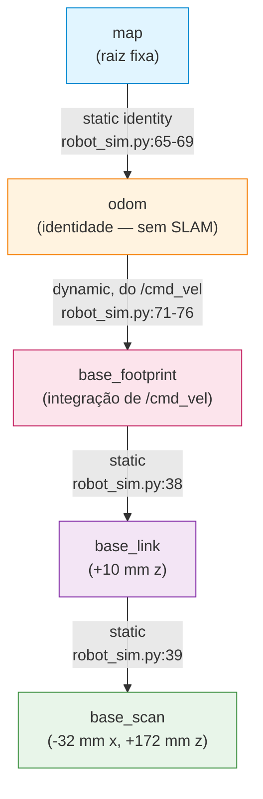
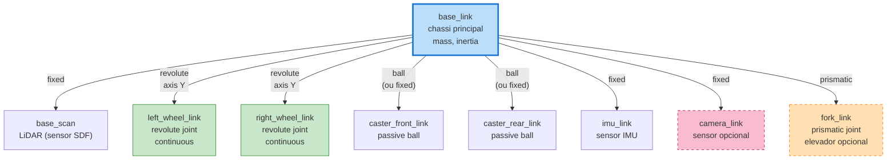
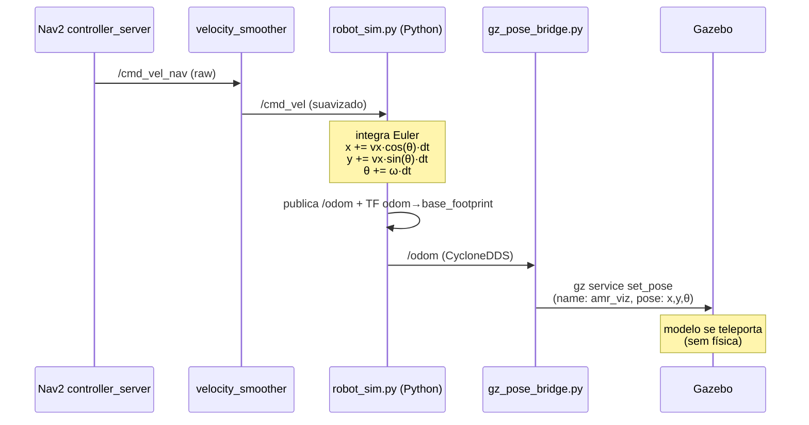

# Análise técnica do "robô" do amr_pallet

> **Documento didático para engenheiro mecânico aprendendo robótica ROS 2.**
> Última atualização: 2026-05-13.

---

## ⚠ Aviso de framing — leia antes de tudo

Este projeto **NÃO tem modelo mecânico de robô** no sentido de engenharia tradicional. Não existe URDF, xacro, multibody dynamics, motor model, atrito, inércia rotacional ou controle por torque.

O que se chama de "robô" aqui é, na verdade, três camadas independentes:

| Camada | Arquivo | O que faz |
|---|---|---|
| **Cinemática** | `amr_pallet/src/amr_pallet/amr_pallet/robot_sim.py` | Integra `/cmd_vel` (v, ω) na pose. Pura matemática 2D. |
| **Geometria visual** | `amr_pallet/src/amr_pallet/models/amr_viz/model.sdf` | Caixinha + cilindros para aparecer no Gazebo. Sem física. |
| **Envelope para Nav2** | `amr_pallet/src/amr_pallet/config/nav2_params.yaml` | Um disco de raio 0.25 m. |

**Analogia industrial**: é como ter um projeto de empilhadeira onde existe (a) um script no CLP supervisório que recebe `setVelocity()` e move uma flag de pose; (b) um símbolo no HMI; (c) um polígono de safety no scanner laser. **Nenhum modelo CAD, nenhuma ficha técnica, nenhuma análise estrutural.** Útil para validar lógica de controle de processo, **inútil para qualquer análise mecânica**.

Com esse aviso firme, o documento detalha tudo o que existe — e o que estaria faltando se você quisesse promover isso a uma simulação mecânica de verdade.

---

## 1. Estrutura mecânica

### 1.1 O que existe (visualização cosmética)

O único "corpo" do robô vive em `amr_pallet/src/amr_pallet/models/amr_viz/model.sdf` (76 linhas). É um modelo SDF Gazebo Harmonic — equivalente ao desenho 2D do gabarito da máquina, sem cálculo estrutural.

```xml
<!-- model.sdf:7  -->
<pose>0 0 0.10 0 0 0</pose>            <!-- spawn 10 cm acima do chão -->

<!-- model.sdf:9-15  inércia DECLARADA mas IGNORADA -->
<inertial>
  <mass>10.0</mass>
  <inertia><ixx>0.1</ixx><iyy>0.1</iyy><izz>0.1</izz>...</inertia>
</inertial>

<!-- model.sdf:17-23  CHASSI -->
<visual name="chassis">
  <pose>0 0 0.05 0 0 0</pose>
  <geometry><box><size>0.50 0.40 0.10</size></box></geometry>
</visual>

<!-- model.sdf:25-31  TAMPA -->
<visual name="lid">
  <pose>0 0 0.13 0 0 0</pose>
  <geometry><box><size>0.46 0.36 0.06</size></box></geometry>
</visual>

<!-- model.sdf:33-40  CÚPULA DO LIDAR -->
<visual name="lidar_dome">
  <pose>0.15 0 0.20 0 0 0</pose>
  <geometry><cylinder><radius>0.04</radius><length>0.06</length></cylinder></geometry>
</visual>

<!-- model.sdf:51-58 e 60-67  "RODAS" — visuais soltos, sem joint -->
<visual name="wheel_left">
  <pose>0 0.22 0.05 1.5708 0 0</pose>
  <geometry><cylinder><radius>0.05</radius><length>0.04</length></cylinder></geometry>
</visual>

<!-- model.sdf:70  GRAVIDADE DESLIGADA -->
<gravity>false</gravity>
```

### 1.2 Tabela de dimensões (todas cosméticas)

| Parte | Dimensão | Posição (x,y,z) rel. ao base_link | Realidade física |
|---|---|---|---|
| Chassi (box) | 0.50 × 0.40 × 0.10 m | (0, 0, 0.05) | sem material/densidade |
| Tampa (box) | 0.46 × 0.36 × 0.06 m | (0, 0, 0.13) | decorativa |
| Cúpula LiDAR (cyl) | ⌀0.08 × 0.06 m | (0.15, 0, 0.20) | apontador visual |
| Seta frontal (box) | 0.06 × 0.04 × 0.02 m | (0.22, 0, 0.08) | indica frente |
| Roda esquerda (cyl) | ⌀0.10 × 0.04 m | (0, +0.22, 0.05) | **solta, sem joint** |
| Roda direita (cyl) | ⌀0.10 × 0.04 m | (0, −0.22, 0.05) | **solta, sem joint** |
| **Footprint Nav2** | disco de raio 0.25 m | centrado em base_link | é o que o planner enxerga |
| **Massa nominal** | 10.0 kg | — | ignorada (gravity=false) |
| **Inércia nominal** | 0.1 / 0.1 / 0.1 kg·m² | — | ignorada |

**Comparação industrial**: para o engenheiro mecânico, o `robot_radius: 0.25` é equivalente ao "raio de proteção" definido no projeto do safety scanner. É o envelope dinâmico que o supervisório usa para evitar colisões. Não diz nada sobre **como** o robô é fisicamente construído.

### 1.3 O que **falta** para virar um modelo mecânico real

| Lacuna | O que deveria existir |
|---|---|
| Modelo CAD | URDF/xacro com geometria de colisão (`<collision>`) por link |
| Distribuição de massa | Tensor de inércia calculado (CAD ou medição) por link |
| Material | Densidade, módulo de Young (para FEM, se for o caso) |
| Wheel-ground contact | `<surface><friction>` com μ_static/μ_kinetic, slip ratio |
| Centro de gravidade | `<inertial><pose>` deslocada do centro geométrico |

---

## 2. Motores e atuação

### 2.1 Onde está o "motor"

Em `amr_pallet/src/amr_pallet/amr_pallet/robot_sim.py:53-60`:

```python
# robot_sim.py:53-60
def _tick(self):
    now = self.get_clock().now()
    dt  = (now - self._last).nanoseconds * 1e-9
    self._last = now

    self._yaw += self._wz * dt                            # ω · dt
    self._x   += self._vx * math.cos(self._yaw) * dt      # vx · cos(θ) · dt
    self._y   += self._vx * math.sin(self._yaw) * dt      # vx · sin(θ) · dt
```

Isto é **dead reckoning idealizado em corpo único**. Como se um servo perfeito recebesse `(v, ω)` e atendesse instantaneamente — sem rampa, sem inércia, sem slip, sem erro.

O callback (`robot_sim.py:49-51`) que recebe o comando:
```python
def _cmd(self, msg):
    self._vx = msg.linear.x       # velocidade linear no eixo x do robô
    self._wz = msg.angular.z      # velocidade angular em torno de z (yaw)
```

### 2.2 O que NÃO existe

| Parâmetro | Status |
|---|---|
| Torque máximo (Nm) | ❌ |
| Constantes Kt / Kv do motor | ❌ |
| Inércia rotacional do rotor | ❌ |
| Relação do redutor | ❌ |
| Atrito viscoso / Coulomb | ❌ |
| Slip ratio (rolagem perfeita assumida) | ❌ |
| PID de baixo nível, encoder, controle por corrente | ❌ |

### 2.3 Limites de velocidade — onde realmente vivem

Vêm do planejador Nav2, não da física. `amr_pallet/src/amr_pallet/config/nav2_params.yaml`:

| Parâmetro | Linha | Valor | Significado |
|---|---|---|---|
| `max_vel_x` | 43 | 0.5 m/s | velocidade linear máxima |
| `max_vel_theta` | 45 | 1.0 rad/s (≈57°/s) | velocidade angular máxima |
| `min_vel_x` | 41 | 0.0 m/s | não anda para trás (DWB) |
| `acc_lim_x` | 49 | 2.5 m/s² | rampa de aceleração linear |
| `acc_lim_theta` | 51 | 3.2 rad/s² | rampa angular |
| `decel_lim_x` | 52 | −2.5 m/s² | frenagem |
| `max_velocity` (smoother) | 182 | [0.5, 0.0, 1.0] | saturação do velocity_smoother |
| `min_velocity` (smoother) | 183 | [−0.5, 0.0, −1.0] | permite ré no smoother |

**Comparação industrial**: equivalente a operar uma empilhadeira pelo sinal de referência do drive, com o drive sendo um "milagre" que entrega a velocidade pedida sem dinâmica. Tipo `MOVE_ABS(velocity := 0.5)` num PLC, ignorando se o sistema mecânico aguenta acelerar 2.5 m/s² — o que, num robô de 10 kg, exigiria ≈25 N de força de tração líquida e ≈1.25 Nm de torque em cada roda de ⌀0.10 m (sem contar inércia rotacional, slip ou atrito).

---

## 3. Sensores

Um único sensor — e ele é **fake**. `robot_sim.py:86-92`:

```python
s = LaserScan()
s.header.frame_id = 'base_scan'
s.angle_min = -math.pi                # -180°
s.angle_max =  math.pi                # +180° (varredura completa)
s.angle_increment = 2*math.pi / 360   # 1° por raio → 360 raios
s.range_min = 0.12                    # cego abaixo
s.range_max = 3.5                     # alcance "nominal"
s.ranges = [float('inf')] * 360       # ⚠ TODOS OS RAIOS = INF (sempre "campo livre")
```

### 3.1 Tabela do LaserScan simulado

| Parâmetro | Valor | Observação / linha |
|---|---|---|
| Tipo | `sensor_msgs/LaserScan` | (simulando LiDAR 2D, p.ex. um LDS-01) |
| Frame | `base_scan` | offset −0.032 m em x, +0.172 m em z relativo ao `base_link` (`robot_sim.py:39`) |
| FOV | 360° | varredura completa |
| Resolução angular | 1° | 360 raios |
| Faixa | 0.12 m – 3.5 m | `robot_sim.py:90` |
| Taxa de publicação | **20 Hz** | timer de 50 ms na linha 29 |
| **Dados** | **todos `inf`** | é como um scanner com saída "campo livre" fixada |

### 3.2 Tudo o que NÃO existe

- ❌ IMU (apesar do plugin Gazebo correspondente estar carregado no mundo)
- ❌ Encoders de roda (a odometria é gerada do `/cmd_vel`, não calculada)
- ❌ Câmera RGB / câmera de profundidade
- ❌ AprilTag detector
- ❌ Ultrassom, infravermelho, bumper, cliff sensor
- ❌ Sensor de carga (peso na garra)
- ❌ Switch de fim-de-curso

**Comparação industrial**: equivalente a um safety laser scanner cuja saída foi fixada em "campo livre" para teste de software. Permite validar o fluxo do supervisório, mas o equipamento iria colidir com tudo no chão de fábrica nesse estado.

---

## 4. Juntas e cinemática

### 4.1 Juntas articuladas

**Zero.** Nenhum `<joint type="revolute">`, `<joint type="prismatic">`, `<joint type="continuous">`. As "rodas" são visuais soltas no SDF — não giram, não suportam carga, não têm contato com o chão.

### 4.2 TF tree (hierarquia de frames de referência)

Definida em `robot_sim.py`, é a "lista de cotas" do projeto, vista pelo ROS 2:

**Static transforms** (`robot_sim.py:34-47`):

```python
# robot_sim.py:37-40
for parent, child, tx, tz in [
    ('base_footprint', 'base_link', 0.0,    0.010),    # chão → centro do chassi (10 mm)
    ('base_link',      'base_scan', -0.032, 0.172),    # base → LiDAR (-32 mm x, +172 mm z)
]:
```

**Dynamic transforms** (`robot_sim.py:65-76`):

```python
# robot_sim.py:65-69
for frame_id, child_id, tx, ty in [('map', 'odom', 0.0, 0.0)]:
    # publica map→odom como identidade (sem SLAM/AMCL ativo)
    ...

# robot_sim.py:71-76
# publica odom→base_footprint integrado de /cmd_vel
```

### 4.3 Cinemática implementada

| Modelo | Suportado? | Onde |
|---|---|---|
| Holônomo idealizado (vx, vy, ωz) | parcial — só vx e ωz | `robot_sim.py:53-60` |
| Diferencial (left_wheel_speed, right_wheel_speed) | ❌ | precisaria converter (v,ω) → (ωL, ωR) |
| Ackermann | ❌ | — |
| Omnidirecional (mecanum) | ❌ | — |

**Comparação mecânica**: a TF tree é exatamente como o sistema de coordenadas de uma CNC (origem peça → origem máquina → torre → ferramenta). Define **onde os pontos estão**, mas não modela articulações — todas as ligações são "soldadas" rigidamente.

---

## 5. Plugins Gazebo

No `amr_pallet/src/amr_pallet/worlds/galp_amr.world:11-17`:

```xml
<plugin filename="gz-sim-physics-system"            name="...Physics"/>
<plugin filename="gz-sim-user-commands-system"      name="...UserCommands"/>
<plugin filename="gz-sim-scene-broadcaster-system"  name="...SceneBroadcaster"/>
<plugin filename="gz-sim-sensors-system"            name="...Sensors">
  <render_engine>ogre2</render_engine>
</plugin>
<plugin filename="gz-sim-imu-system"                name="...Imu"/>
```

### 5.1 Tabela de plugins ativos

| Plugin | Linha | Função | Atua no robô? |
|---|---|---|---|
| `gz-sim-physics-system` | 11 | Motor ODE (integração de movimento, colisões) | **Não** — `amr_viz` tem `gravity=false` e nenhum joint. Atua só sobre paredes/pallets (estáticos). |
| `gz-sim-user-commands-system` | 12 | Expõe serviços (`/world/<world>/set_pose`, `create`, `remove`) | **Sim, indiretamente** — é por aqui que o `gz_pose_bridge.py` teleporta o robô |
| `gz-sim-scene-broadcaster-system` | 13 | Publica a árvore da cena (`/world/<world>/state`) para o GUI renderizar | **Sim** — é por isso que você vê o robô no VNC |
| `gz-sim-sensors-system` (Ogre2) | 14-15 | Renderiza sensores virtuais (câmera, LiDAR) | **Não** — `amr_viz` não tem `<sensor>` no SDF |
| `gz-sim-imu-system` | 17 | Calcula leituras de IMU para links com sensor IMU | **Não** — nenhum IMU |

### 5.2 Plugins que **estariam presentes** numa simulação de verdade

| Plugin | Função | Substituiria |
|---|---|---|
| `gz-sim-diff-drive-system` | Converte `/cmd_vel` em torque nas duas rodas. Lê `wheel_separation`, `wheel_radius`. | `_cmd` + `_tick` do `robot_sim.py` |
| `gz-sim-joint-state-publisher-system` | Publica posições/velocidades das juntas (rodas, garfo) | — (não existe hoje) |
| `gz-sim-pose-publisher-system` | Publica pose real do robô | `gz_pose_bridge.py` |
| `gz-sim-odometry-publisher-system` | Publica odometria com slip realista | publicação manual em `robot_sim.py:78-84` |
| `gz-sim-sensors-system` com sensor `<gpu_lidar>` no SDF | Faz raycast de verdade no mundo | LaserScan fake em `robot_sim.py:86-92` |

**Comparação CAE/industrial**: hoje é como rodar uma simulação CFD só com o domínio estático e fazer pós-processamento "manual" para mover um sólido visual em cima. Nada é emergente — todo movimento é prescrito de fora.

---

## 6. Diagramas

### 6.1 TF tree atual (o que existe)



### 6.2 URDF tree hipotético (o que poderia existir num modelo mecânico real)



> Itens tracejados (`fork_link`, `camera_link`) seriam adições opcionais conforme aplicação.

### 6.3 Fluxo de comando atual (loopback)



---

## 7. Tabela comparativa: como é hoje vs o que pode ser modificado

| Domínio | Estado atual | Pode ser modificado para | Esforço |
|---|---|---|---|
| **Modelo geométrico** | SDF cosmético de viz | URDF/xacro completo com colisões + inércia | médio (1 dia) |
| **Massa real** | 10 kg nominal, ignorada | Calculada do CAD ou medida; usada pela física | baixo se já tem CAD |
| **Inércia** | tensor isotrópico 0.1 kg·m² | tensor real do modelo 3D | depende do CAD |
| **Rodas** | cilindros visuais soltos | 2 rodas com `<joint type="continuous">` + atrito + slip | médio |
| **Casters/rodízios** | inexistentes | 4 rodízios passivos (caster wheels) | baixo |
| **Motor** | abstração `vx, ωz` | `gz-sim-diff-drive-system` com `wheel_separation`, `wheel_radius`, `torque_max` | baixo |
| **Encoder / odometria** | publicada direto do comando (sem erro) | calculada pelo plugin, com ruído gaussiano opcional | baixo |
| **Velocidade máx** | limite do planner (0.5 m/s) | limite físico do motor (com saturação de torque) | médio |
| **Aceleração máx** | rampa do planner (2.5 m/s²) | emergente da relação F = m·a, dado torque/redução/raio | médio |
| **LiDAR** | fake (ranges = ∞) | sensor `<gpu_lidar>` raycasting o mundo real | baixo |
| **IMU** | inexistente | sensor `<imu>` no `base_link`, plugin já carregado | trivial |
| **Câmera** | inexistente | sensor `<camera>` ou `<depth_camera>` | médio |
| **Garra/elevador de pallet** | inexistente | `<joint type="prismatic">` + plugin `joint_position_controller` | médio |
| **Footprint Nav2** | disco r=0.25 m | polígono retangular calcado nas dimensões reais | trivial |
| **Mundo Gazebo** | warehouse 20×15 m (estático) | adicionar pallets dinâmicos, obstáculos móveis, AGV vizinho | baixo |
| **Bridge ros↔gz** | só pose teleporte (Python externo) | `ros_gz_bridge` para `/cmd_vel`, `/odom`, `/scan`, `/tf`, `/clock` | médio |
| **SLAM** | inexistente (map fornecido pronto) | `slam_toolbox` em modo async | baixo |
| **Localização** | inexistente (map→odom = identidade) | `nav2_amcl` consumindo `/scan` real | baixo |
| **Multi-robô** | um único `amr_viz` | spawnar N robôs com namespace `/amr_001`, `/amr_002`, ... | médio |

---

## 8. Localização exata de cada parâmetro

### 8.1 Estrutura mecânica (visual)

| Parâmetro | Caminho | Linha |
|---|---|---|
| Pose inicial | `amr_pallet/src/amr_pallet/models/amr_viz/model.sdf` | 7 |
| Massa | mesmo arquivo | 10 |
| Inércia | mesmo arquivo | 11-14 |
| Chassi (box 0.50×0.40×0.10) | mesmo arquivo | 17-23 |
| Tampa (box 0.46×0.36×0.06) | mesmo arquivo | 25-31 |
| Cúpula do LiDAR (cyl) | mesmo arquivo | 33-40 |
| Seta frontal (box) | mesmo arquivo | 42-49 |
| Roda esquerda (cyl) | mesmo arquivo | 51-58 |
| Roda direita (cyl) | mesmo arquivo | 60-67 |
| `<gravity>false` | mesmo arquivo | 70 |

### 8.2 Cinemática (Python)

| Parâmetro | Caminho | Linha |
|---|---|---|
| Frequência de tick | `amr_pallet/src/amr_pallet/amr_pallet/robot_sim.py` | 29 (`create_timer(0.05)`) |
| Callback `/cmd_vel` | mesmo arquivo | 49-51 |
| Integração de pose | mesmo arquivo | 53-60 |
| TF estática base_footprint→base_link (z=+0.010) | mesmo arquivo | 38 |
| TF estática base_link→base_scan (x=−0.032, z=+0.172) | mesmo arquivo | 39 |
| TF dinâmica map→odom (identidade) | mesmo arquivo | 65-69 |
| TF dinâmica odom→base_footprint | mesmo arquivo | 71-76 |
| Publicação de `/odom` | mesmo arquivo | 78-84 |
| Publicação de `/scan` (fake) | mesmo arquivo | 86-92 |

### 8.3 Sensor (LaserScan fake)

| Parâmetro | Caminho | Linha |
|---|---|---|
| Frame | `robot_sim.py` | 87 |
| Ângulo mínimo/máximo (−π a +π) | mesmo arquivo | 88 |
| Incremento (2π/360) | mesmo arquivo | 89 |
| Faixa (0.12 – 3.5 m) | mesmo arquivo | 90 |
| Valores (todos ∞) | mesmo arquivo | 91 |

### 8.4 Plugins Gazebo

| Parâmetro | Caminho | Linha |
|---|---|---|
| Tipo física (ODE) | `amr_pallet/src/amr_pallet/worlds/galp_amr.world` | 5 |
| Real-time update rate (1000 Hz) | mesmo arquivo | 6 |
| Max step size (1 ms) | mesmo arquivo | 7 |
| Real-time factor | mesmo arquivo | 8 |
| Physics plugin | mesmo arquivo | 11 |
| UserCommands plugin | mesmo arquivo | 12 |
| SceneBroadcaster plugin | mesmo arquivo | 13 |
| Sensors plugin (ogre2) | mesmo arquivo | 14-15 |
| IMU plugin | mesmo arquivo | 17 |

### 8.5 Restrições de movimento (Nav2)

| Parâmetro | Caminho | Linha |
|---|---|---|
| `robot_base_frame` (controller) | `amr_pallet/src/amr_pallet/config/nav2_params.yaml` | 4 |
| `controller_frequency` (10 Hz) | mesmo arquivo | 19 |
| `min_vel_x` (0.0) | mesmo arquivo | 41 |
| `max_vel_x` (0.5 m/s) | mesmo arquivo | 43 |
| `max_vel_theta` (1.0 rad/s) | mesmo arquivo | 45 |
| `acc_lim_x` (2.5 m/s²) | mesmo arquivo | 49 |
| `acc_lim_theta` (3.2 rad/s²) | mesmo arquivo | 51 |
| `decel_lim_x` (−2.5 m/s²) | mesmo arquivo | 52 |
| `robot_base_frame` (local costmap) | mesmo arquivo | 84 |
| `rolling_window` | mesmo arquivo | 85 |
| `resolution` (0.05 m/cell) | mesmo arquivo | 88 |
| `robot_radius` (0.25 m) — local costmap | mesmo arquivo | 89 |
| `inflation_radius` (0.6 m) — local | mesmo arquivo | 94 |
| `robot_radius` (0.25 m) — global costmap | mesmo arquivo | 104 |
| `inflation_radius` (0.6 m) — global | mesmo arquivo | 116 |
| `max_velocity` smoother [0.5, 0, 1.0] | mesmo arquivo | 182 |
| `max_accel` smoother [2.5, 0, 3.2] | mesmo arquivo | 184 |
| `base_frame_id` (smoother) | mesmo arquivo | 193 |
| `odom_frame_id` (smoother) | mesmo arquivo | 194 |
| `controller_frequency` (collision_monitor) | mesmo arquivo | 222 |

### 8.6 Mapas

| Mapa | Caminho | Resolução | Origem | Uso |
|---|---|---|---|---|
| `warehouse` | `amr_pallet/src/amr_pallet/maps/warehouse.yaml` | 0.05 m/px | [−10.0, −7.5, 0] | usado pelo `warehouse.launch.py` |
| `galp_amr` | `amr_pallet/src/amr_pallet/maps/galp_amr.yaml` | 0.05 m/px | [−5.0, −4.0, 0] | alternativo |

---

## 9. PRÓXIMAS MODIFICAÇÕES POSSÍVEIS

Lista ordenada do mais barato/útil para o mais complexo. Cada item indica **escopo, esforço, impacto** e **risco de regressão**.

### 9.1 Trivial (minutos, baixo risco)

- **Adicionar sensor IMU virtual no `amr_viz`**
  Como: adicionar `<sensor name="imu" type="imu">` ao `model.sdf` + bridge gz↔ros para `/imu/data`. O plugin `gz-sim-imu-system` já está carregado.
  Impacto: dá feed de aceleração/orientação que pode alimentar EKF (`robot_localization`) e melhorar odometria.
  Risco: nenhum.

- **Corrigir o footprint de disco para polígono retangular**
  Como: trocar `robot_radius: 0.25` por `footprint: "[[0.25,0.20],[0.25,-0.20],[-0.25,-0.20],[-0.25,0.20]]"` em `nav2_params.yaml:89` e `:104`. Reflete a forma real (0.50×0.40).
  Impacto: planejamento mais preciso, especialmente em corredores estreitos.
  Risco: pode rejeitar caminhos válidos se mal-calibrado.

- **Aumentar `range_max` do scan fake para 8 m** (mais realista para LDS típico em galpão)
  Como: `robot_sim.py:90`.
  Impacto: nenhum hoje (todos os raios são ∞), mas prepara terreno.
  Risco: zero.

### 9.2 Baixo (1-2 horas)

- **Substituir o LaserScan fake por raycast real no Gazebo**
  Como: adicionar `<sensor type="gpu_lidar">` no `model.sdf`, configurar `ros_gz_bridge` para `/scan`, **remover** a publicação manual em `robot_sim.py:86-92`.
  Impacto: enorme — Nav2 passa a ver os pallets/paredes do mundo, costmaps locais ficam significativos, behaviors (`spin`, `backup`) fazem sentido.
  Risco: médio — o costmap local vai começar a marcar obstáculos onde antes não tinha; a missão pode falhar mais até calibrar.

- **Plugin `gz-sim-diff-drive` em vez de `robot_sim.py`**
  Como: adicionar 2 juntas continuous (`left_wheel_joint`, `right_wheel_joint`) ao SDF; instanciar `<plugin filename="gz-sim-diff-drive-system">` com `wheel_separation`, `wheel_radius`, `topic: cmd_vel`; bridge para `/odom`. Aposentar o `robot_sim.py`.
  Impacto: dinâmica de motor passa a ser real (rampa emergente de torque/massa), slip pode ser modelado.
  Risco: alto — precisa ajustar massa/inércia e atrito para o robô andar sem capotar; a aceleração nominal de 2.5 m/s² provavelmente fica inviável com torque típico de motor pequeno.

- **Adicionar SLAM (slam_toolbox)**
  Como: incluir `slam_toolbox` no launch em modo `async_slam`; remover `map_server`. Requer o scan real (item anterior).
  Impacto: o robô passa a mapear sozinho. Útil para galpões que mudam.
  Risco: médio — exige bom `/scan` e odometria razoavelmente boa.

### 9.3 Médio (1 dia)

- **Escrever URDF/xacro completo do robô**
  Como: criar `amr_pallet/urdf/amr.urdf.xacro` com `base_link`, `left_wheel_link`, `right_wheel_link`, 4 casters, `imu_link`, `lidar_link`. Cada um com `<inertial>`, `<collision>`, `<visual>`. Lançar `robot_state_publisher` no launch.
  Impacto: TF tree fica gerada automaticamente; reaproveitamento em qualquer simulador; integração com RViz/MoveIt natural.
  Risco: baixo — substitui as TFs estáticas manuais; precisa garantir que os frames se chamam igual (`base_link`, `base_footprint`, `base_scan`).

- **Footprint dinâmico (sob carga)**
  Como: publicar dois footprints no Nav2 — um "vazio" e um "com pallet" (maior); selecionar via service quando o robô coleta/entrega. Requer estados internos na missão.
  Impacto: planejamento mais seguro carregando carga.
  Risco: baixo.

- **Adicionar elevador de pallet (prismatic joint)**
  Como: criar `fork_link` com `<joint type="prismatic">` (limite 0–0.15 m, eixo z). Plugin `joint_position_controller` para controlar via topic. Integrar com a missão (sobe na coleta, desce na entrega).
  Impacto: missão passa a fazer ações físicas reais; pode-se simular falhas de coleta.
  Risco: médio — exige ajustar a interação com `pallet_1..4` no mundo (anexar/destacar).

### 9.4 Avançado (multi-dia)

- **Localização AMCL real**
  Como: `nav2_amcl` consumindo `/scan` e `/odom` reais; remover a publicação `map→odom` identidade do `robot_sim.py:65-69`.
  Impacto: o robô passa a se localizar com erro real (e a missão precisa lidar com isso).
  Risco: alto — descalibragens causam "robô teleportando" no RViz.

- **Multi-robô (fleet)**
  Como: spawnar 2-4 instâncias do `amr_viz` com namespaces `/amr_001/`, `/amr_002/`. Adaptar launches para parametrizar. Servidor central de orquestração (mini OpenRMF).
  Impacto: simula operação real de galpão.
  Risco: alto — colisões inter-robô viram um problema; conflitos de TF.

- **Modelo dinâmico completo de pallet/peso**
  Como: adicionar massa real aos pallets; modelar o contato garra-pallet com `<joint type="fixed">` criada em runtime quando o garfo está embaixo (`gz service` para attach/detach).
  Impacto: a inércia do robô muda ao pegar pallet (m_robô + m_pallet); o controlador pode falhar nas curvas com carga.
  Risco: alto — calibragem extensa de torque, atrito e PID; mas é o que aproxima de comportamento de galpão real.

- **CFD de fluxo de ar ou simulação acústica** (provavelmente fora de escopo aqui)
  Para análise ergonômica, ruído, ou ventilação do galpão. Não tem suporte direto no Gazebo.

---

## Apêndice — Resumo executivo em uma página

| Pergunta | Resposta |
|---|---|
| O robô tem URDF? | **Não.** |
| Existe modelo dinâmico (massa, inércia, motor)? | **Não.** Tudo cinemático idealizado. |
| Como o robô anda? | Python integra `/cmd_vel` direto na pose. |
| Como aparece no Gazebo? | SDF cosmético (`amr_viz`) com `gravity=false`, teleportado a 15 Hz por um bridge. |
| Tem LiDAR de verdade? | Não. LaserScan fake sempre publicando "campo livre". |
| Tem IMU, câmera, encoder? | Não. |
| O Nav2 sabe o tamanho do robô? | Sim, como **disco de raio 0.25 m**. |
| Quanto pesa? | "10 kg" declarados no SDF, mas ignorado (gravidade off). |
| Velocidade máxima? | 0.5 m/s linear, 1.0 rad/s angular — limitado pelo Nav2, não pela física. |
| O sistema é simulação ou demo de software? | **Demo de software de navegação** usando um robô-fantasma. |
| Posso fazer análise mecânica disso? | Não — precisa primeiro construir URDF + plugins de física. |
| O quanto falta para virar simulação real? | ~2-3 dias de trabalho focado para chegar a um nível "TurtleBot3-equivalente". |
